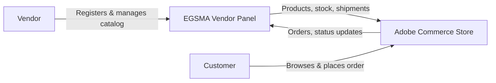

# Introduction

**EGSMA Marketplace Integration for Adobe Commerce** connects your Adobe Commerce store with the EGSMA platform and turns it into a scalable multi-vendor marketplace.

Adobe Commerce as a Cloud Service is built for single-store selling. It does not support multi-vendor marketplaces by default. With this integration, multiple vendors can register, and each vendor gets a separate panel to manage their catalog and orders.

The integration is delivered as an **Adobe App Builder** app. It extends your store without modifying the core system.

---

## What is EGSMA Marketplace Integration

The integration acts as a bridge between your Adobe Commerce storefront and the EGSMA vendor management system.

- **Vendors** work from the EGSMA platform to manage products, stock, orders, and shipments.
- **Your Adobe Commerce store** stays the main customer-facing website.
- **Data synchronization** keeps products, orders, and inventory consistent across both platforms.

---

## How the Integration Works

1. The integration connects Adobe Commerce with EGSMA so both platforms can exchange data.
2. Vendors register on the EGSMA platform and access their dashboard.
3. Vendors manage products, inventory, and updates from the panel. Those products appear on the Adobe Commerce store.
4. Customers browse and buy directly from your website.
5. When an order is placed, its details are shared with EGSMA in real time.
6. Vendors process orders, shipping, and fulfillment from their panel. These updates sync back to Adobe Commerce.

---

## Key Features

- **Multi-vendor selling:** Multiple vendors register and sell products independently on a single marketplace.
- **Real-time catalog sync:** Products, inventory, and categories sync between Adobe Commerce and EGSMA.
- **Full product control:** Vendors create, update, and delete products, variants, images, and categories.
- **Automatic product transfer:** New products move between both platforms without manual effort.
- **Instant order sync:** Customer orders sync from Adobe Commerce to the vendor panel as soon as they are placed.
- **Shipment management:** Vendors create and manage shipments directly from the EGSMA panel.
- **Flexible catalog:** Supports both simple and configurable product types.
- **Less manual work:** Data exchange between Adobe Commerce and EGSMA is fully automated.

---

## Supported Product Types

| Type | Description |
|---|---|
| **Simple Products** | Basic products without variants. |
| **Configurable Products** | Products with multiple variants, such as size or color. |

::: tip Product Version
This guide covers **version 1.0.0** of the EGSMA Marketplace Integration.
:::
