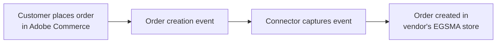

# Order Synchronization

When a customer places an order in Adobe Commerce, the vendor receives it on EGSMA in real time. Both platforms always show the same order information.

---

## How Order Sync Works

1. Adobe Commerce triggers an order creation event when the order is placed.
2. The connector captures the event instantly.
3. The connector sends the order data to the vendor's EGSMA store.
4. EGSMA creates the order automatically — no manual input required.

---

## Order Data Synced

| Data | Included |
|---|---|
| Customer information | ✓ |
| Billing and shipping addresses | ✓ |
| Ordered products and quantities | ✓ |
| Pricing and totals | ✓ |
| Payment method | ✓ |
| Current order status | ✓ |

This gives the vendor complete order visibility in the EGSMA panel.

---

## Order Status Updates

When an order is updated in Adobe Commerce, the change is processed immediately:

1. The updated order information is sent to the EGSMA vendor end in real time.
2. The status update appears instantly in the vendor panel.

The marketplace and the vendor system keep an accurate, consistent order status at all times.

Next: [Shipment & Fulfillment Sync](/orders/shipment-sync.md).
