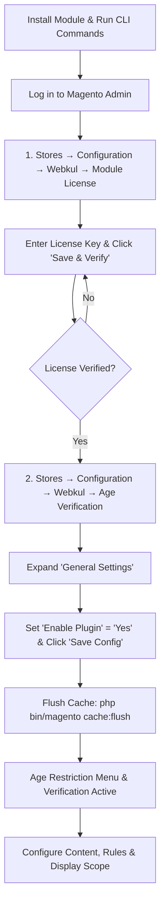
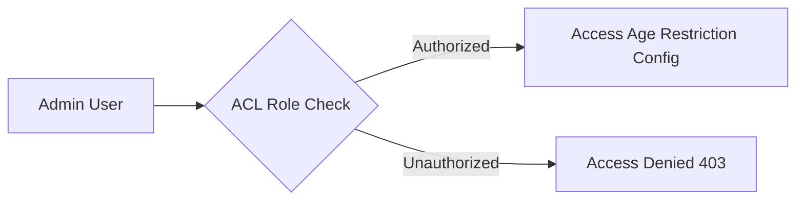

# Activate & Connect

After completing module installation, you must verify its registration, activate your license key, and enable the extension in store configuration before administrative features and storefront age verification restrictions become active.

::: important Age Restriction Admin Menu Visibility
By default, the **Age Restriction** settings and storefront validation will **not** be fully active immediately after installation. The configuration options and storefront restrictions appear only after completing two required steps:
1. **Module License Verification** under **Stores → Configuration → Webkul → Module License**.
2. **Enabling the Extension** under **Stores → Configuration → Webkul → Age Verification → General Settings**.
:::



## Step 1: Verify Module Status via CLI

Before logging into the admin panel, confirm that the `Webkul_AgeRestriction` module is registered and enabled in Magento core via the CLI:

```bash
php bin/magento module:status Webkul_AgeRestriction
```

If the module is listed as disabled, enable it and update your store:

```bash
php bin/magento module:enable Webkul_AgeRestriction --clear-static-content
php bin/magento setup:upgrade
php bin/magento cache:flush
```

## Step 2: License Verification

The module requires a verified license key before it can be activated in your Magento store:

1. Log in to your **Magento Admin Panel**.
2. In the left admin menu, navigate to **Stores → Configuration**.
3. In the left panel under the **Webkul** tab, click **Module License**.
4. In the **Licensed Modules** section, locate the **Age Restriction** entry.
5. Notice that the initial status displays as **UNVERIFIED**.
6. Enter your valid **License Key** (obtained from your Webkul store account) into the *Enter license key* field.
7. Click the **Save & Verify** button.
8. Once verified successfully, the module status updates to verified, validating your installation.

::: note Where to Find Your License Key
You can retrieve your extension license key by logging into your [Webkul Account](https://store.webkul.com/customer/account/login/) and visiting **My Account → My Purchased Products**.
:::

## Step 3: Enable the Extension in Store Configuration

After completing license verification, you must enable the extension from the Magento store configuration settings to activate the verification engine and display rules:

1. In the Magento Admin Panel, navigate to **Stores → Configuration**.
2. In the left navigation panel, expand **Webkul** and select **Age Verification**.
3. Locate and click to expand the **General Settings** section.
4. Set **Enable Plugin** to **Yes**.
5. (Optional) Upload a custom header **Image** / logo for the age verification modal (allowed formats: `jpg`, `jpeg`, `gif`, `png`, max size: `2MB`).
6. Click the orange **Save Config** button in the top-right corner.
7. Flush the Magento cache:
   ```bash
   php bin/magento cache:flush
   ```


::: tip Settings Details
For a detailed breakdown of popup content titles, verification methods (DOB, Checkbox, Yes/No), cookie lifetimes, and color styling, refer to the [Admin Settings Reference](/configuration/settings) guide.
:::

## Step 4: Access Admin Menu Navigation

Once the license is verified and the extension is enabled in store configuration, the **Age Restriction** menu options become active and accessible in the Magento Admin navigation:

1. Refresh your admin page or navigate to any admin section.
2. In the main left sidebar navigation, click the **Webkul** menu icon.
3. Under **Age Restriction**, click the menu options:
   - **Configuration Settings**: Direct navigation to view and configure all age restriction settings (General, Content, Terms & Conditions, Display Settings, Design).
   - **Support**: Dedicated section providing direct access to Webkul resources, assistance, and extension details:
     - **User Guide**: Direct link to the online documentation and user guides.
     - **Store Extension**: View the official Webkul Store module page for release notes and updates.
     - **Ticket/Customisations**: Open support tickets or submit custom feature inquiries via Webkul UVdesk.
     - **Services**: Explore Webkul's Magento development, migration, and custom development services.
     - **Reviews**: View and submit reviews on the Webkul store.
     - **Version**: Displays the installed module version (e.g., *Version 5.0.5*).

## Step 5: Configure Admin ACL Permissions

If your store utilizes custom or restricted administrative roles, grant access to the Age Restriction resources:

1. In the admin panel, navigate to **System → Permissions → User Roles**.
2. Select the role you wish to configure (e.g., *Catalog Managers* or *Compliance Officers*).
3. Under **Role Resources**, set *Resource Access* to **Custom** and ensure the following resources are checked:
   - **Age Restriction** (`Webkul_AgeRestriction::menu`)
   - **Configuration Settings** (`Webkul_AgeRestriction::config`)
   - **Support** (`Webkul_AgeRestriction::support`)
4. Click **Save Role**.



## Step 6: Verify on the Frontend

After activating the module, verify that age verification behaves as expected across the storefront:

1. Open a new **Private / Incognito** browser window (or clear browser cookies and localStorage).
2. Navigate to any restricted CMS page, category, or product page configured with age verification.
3. Confirm the following storefront behavior:
   - **Background Blur Effect**: The background store page content is blurred and non-interactive until verification is completed.
   - **Modal Dialog Prompt**: The age verification modal opens automatically in the center of the viewport with the configured title, description, and verification method.
   - **Verification Evaluation**:
     - *Date of Birth*: Users below the minimum required age (e.g., under 18) are rejected and redirected to the configured Leave URL. Users meeting the age threshold are granted access.
     - *Checkbox Option*: Checking the box and clicking Enter grants access.
     - *Yes/No Button*: Clicking "Yes" admits the visitor; clicking "No" redirects to the Leave URL.
   - **Purchase Access**: Once verified, the age restriction modal closes, background unblurs, and the *Add to Cart* button and product details become fully accessible.
   - **Cookie Persistence**: Upon reloading or navigating between restricted pages, the visitor is not re-prompted until the configured cookie lifetime expires.


::: tip Next Step
With the module verified and enabled, proceed to [Configuration Overview](/configuration/overview) to understand how verification methods, display scopes, and cart protections work.
:::
