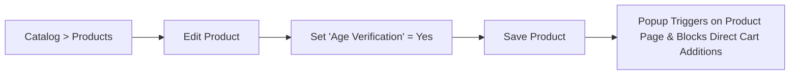

# Product & Category Setup

In addition to global CMS page rules, the **Age Restriction** extension allows you to apply restrictions directly to specific catalog products and categories.

---

## Restricting Individual Products

You can enforce age verification on specific products (such as adult items, alcoholic beverages, or tobacco) without locking down your entire store.

### Step-by-Step Configuration

1. In the Magento Admin Panel, navigate to **Catalog > Products**.
2. Select and edit the target product.
3. In the product edit screen, find the **Age Verification** toggle attribute (`product_age_verification`).
4. Toggle the switch to **Yes** (or select `Yes` if displayed as a dropdown).
5. Click **Save** in the top right corner.

::: tip Note
When **Display on Products** is set to `Yes` in System Configuration, visiting a restricted product page triggers the age verification modal. If an unverified user attempts to add the item directly to their cart, the `Cart` plugin blocks the request.
:::

---

## Restricting Catalog Categories

When you restrict a category, any customer navigating to that category listing page or catalog search result within that category will be prompted to verify their age.

### Step-by-Step Configuration

1. In the Magento Admin Panel, navigate to **Catalog > Categories**.
2. Select the category from the category tree on the left.
3. In the **General Information** section, locate the **Age Verification** toggle (`category_age_varification`).
4. Set the toggle to **Yes**.
5. Click **Save** to apply changes.

::: tip Recommendation
Setting age verification on a parent category protects its category view page. For full protection of individual product detail pages, ensure the product-level attribute is also enabled on sensitive products.
:::

---

## Restricting Specific CMS Pages

To restrict CMS pages (e.g., Homepage, Promotional Landing Pages, Blog, or Content pages):

1. Navigate to **Stores > Configuration > Webkul > Age Verification**.
2. Under **Display Settings**, ensure **Display on CMS Pages** is set to `Yes`.
3. In the **Select CMS Pages** multiselect list, select one or more CMS pages (hold `Ctrl` or `Cmd` to select multiple pages).
4. Click **Save Config** and flush the cache (`bin/magento cache:clean config full_page`).
