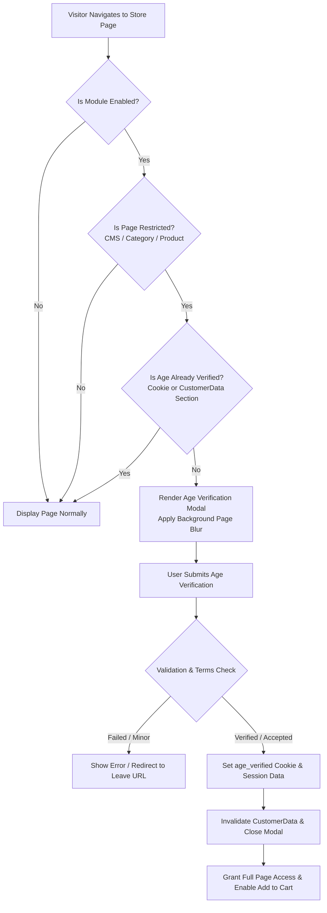

# Introduction

The **Webkul Magento 2 Age Restriction (Verification)** extension empowers store owners to enforce age verification compliance across their Magento 2 store. It displays an interactive age verification popup modal before visitors can view or purchase age-restricted catalog products, browse restricted categories, or access specific CMS pages.

This extension is built for merchants selling age-sensitive goods, such as tobacco, e-cigarettes, alcoholic beverages, adult products, gaming/lottery items, or any products subject to legal age limits.

---

## Key Capabilities & Features

| Capability | Specification & Details |
|---|---|
| **Module Name & Version** | `Webkul_AgeRestriction` — Version `5.0.5` |
| **Verification Methods** | 1. **Date of Birth (`using_dob`)** with dropdown selectors 2. **Checkbox Option (`checkbox_option`)** 3. **Yes/No Action Buttons (`yesno_button`)** |
| **Date Formats** | Supports `Day,Month,Year` (`dd-mm-yy`), `Month,Year,Day` (`mm-yy-dd`), and `Year,Day,Month` (`yy-dd-mm`) |
| **Minimum Age Validation** | Configurable minimum age limit between `1` and `100` years |
| **Targeted Restrictions** | Granular restriction targeting on **CMS Pages**, **Catalog Categories**, and individual **Products** |
| **Cart Protection** | Intercepts cart additions via plugin (`Webkul\AgeRestriction\Model\Plugin\Cart`) to prevent adding age-restricted products without verification |
| **Terms & Conditions** | Built-in consent checkbox with customizable label text, hyperlinked URL, and mandatory acceptance validation |
| **Cookie Lifetime** | Configurable cookie duration in days to prevent repetitive verification popups on recurring visits |
| **Full Page Cache Compatible** | Uses Magento 2 CustomerData private content section (`agerestrictedsection`) and public cookie metadata |
| **Modal Design & Styling** | Customizable popup width (`200px`–`1000px`), background color, text color, and individual Enter/Leave button styles (color, text color, border color, border radius) |
| **Custom Header Image** | Upload a custom brand logo or warning badge directly from admin configuration |
| **Redirect on Leave** | Custom leave button URL redirect (e.g., Google or store policy page) when a user cancels or fails verification |
| **GraphQL API** | Headless support for querying configuration settings, validating age, and setting verification state |

---

## Verification Workflow Architecture

---

## Guide Structure

Explore the documentation sections to get started and configure the module:

- [Requirements](/requirements) — System prerequisites and Magento / PHP compatibility.
- [Installation](/installation) — Step-by-step installation instructions via Composer or ZIP archive.
- [Activate & Connect](/activation) — Enabling the extension and performing initial setup.
- [Configuration Overview](/configuration/overview) — Deep dive into verification methods and caching mechanics.
- [Admin Settings Reference](/configuration/settings) — Complete field-by-field reference of all backend settings.
- [Product & Category Setup](/configuration/product-category-setup) — Applying restrictions to catalog items and CMS pages.
- [GraphQL API](/configuration/graphql) — Headless and PWA integration guide.
- [Troubleshooting](/help/troubleshooting) — Solutions to common setup questions.
- [FAQ](/help/faq) — Frequently asked questions.

