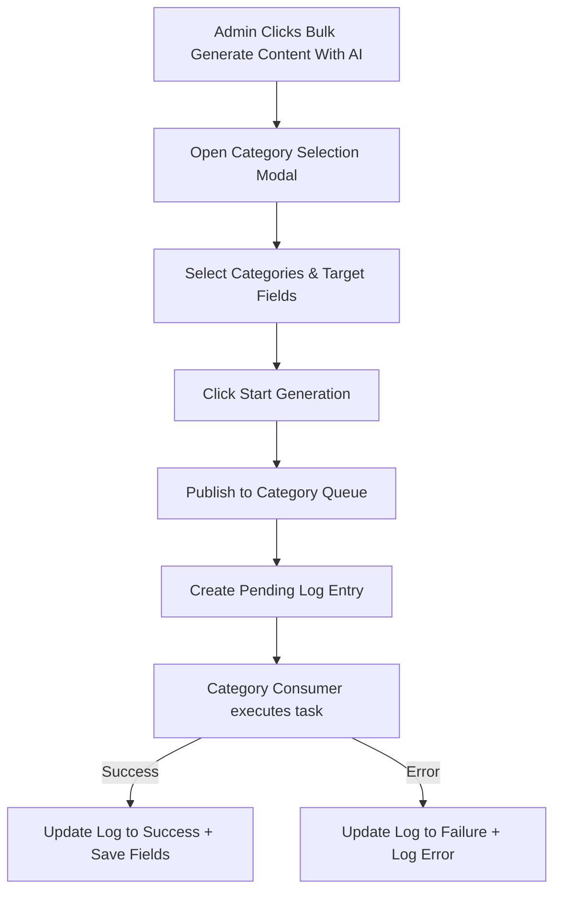

# Category Workflows

The AI Content Generator module supports both individual, on-demand content creation and large-scale bulk updates for categories.

---

## 1. Individual Category Generation

Store managers can generate tailored copy directly while editing category records in the Magento Admin Panel.

### Description
* **Description**: Click **Fill description with AI Content Generator** near the main category description WYSIWYG editor.

### SEO Metadata
* **SEO Metadata**: Expand the **Search Engine Optimization** tab and click **Import AI Content**.

---

## 2. Category Bulk Generation (Asynchronous Queue)

Category bulk generation is handled asynchronously through a dedicated modal setup with a category tree picker (accessible directly from the Category editing area):

### How to trigger Category bulk generation
1. Navigate to **Catalog** &rarr; **Categories**.
2. Click the **Bulk Generate Content With AI** button at the top header of the category page.
3. In the modal slide-out:
   * **Select Categories**: Choose one or multiple categories from the interactive category tree.
   * **Select Fields to Generate**: Check the target attributes (Category Description, Meta Title, Meta Description, Meta Keywords).
   * **Content Handling Preference**: Toggle whether to skip fields that already have content.
4. Click **Start Generation** to send the AJAX trigger and queue the tasks in the background.

---

## 3. Category Generation Logs & Monitoring

To monitor category background tasks and view generation metrics, navigate to the status logs:

### Category Generation Logs
::: tip Navigation Path
**AI Content Generator** &rarr; **Menu** &rarr; **Category Generation Status**
:::

This grid tracks category processing status in real-time, detailing any errors encountered during background AI runs.

* **Category ID**: The target category ID.
* **Category Name**: Name of the target category.
* **Generated Content**: Execution status summary or generated content preview.
* **Execution Status**: `Pending`, `Success`, or `Failure`.
* **Timestamp**: When the task was submitted and finished.
* **Actions**: Re-trigger generation for failed or pending items.

### Retrying Failed Category Content Generation

If a category generation fails due to API outages or temporary rate limits, store managers can re-queue generation directly from the **Category Generation Status** grid without re-opening the bulk category modal.

#### Single Category Retry
1. Locate the target category in the **Category Generation Status** grid.
2. In the **Action** column, click **Retry AI Generation**.
3. The log status resets to `Pending` (*Queued for background retry*) and dispatches the background consumer worker.

#### Bulk / Mass Category Retry
1. Multi-select one or more category entries using the grid checkboxes.
2. Click the **Actions** dropdown menu at the top-left of the grid.
3. Select **Retry AI Generation**.
4. Confirm the prompt to mass-queue all selected categories for background re-execution.

