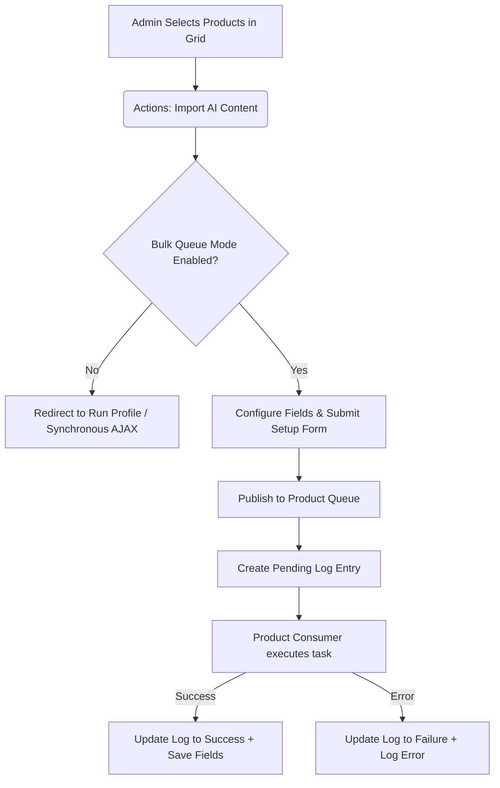

# Product Workflows

The AI Content Generator module supports both individual, on-demand content creation and large-scale bulk updates for products.

---

## 1. Individual Product Generation

Store managers can generate tailored copy directly while editing individual products in the Magento Admin Panel.

### Description & Short Description
* **Description / Short Description**: Click the **Fill description with AI Content Generator** button located directly beneath the WYSIWYG editors.

### SEO Metadata
* **SEO Metadata**: Expand the **Search Engine Optimization** tab and click **Generate SEO Content** to generate the Meta Title, Meta Keywords, and Meta Description simultaneously.

---

## 2. Product Bulk Generation (Asynchronous Queue)

For catalog-wide updates, processing content synchronously in the browser can cause timeouts or gateway crashes. When message queue mode is enabled for products, the module schedules generation tasks in the background:

### How to trigger Product bulk generation
1. Navigate to **Catalog** &rarr; **Products**.
2. Multi-select the desired items in the grid.
3. In the **Actions** dropdown menu, select **Import AI Content**.
4. Choose the target **Store View** scope.
5. On the configuration screen (when bulk queue mode is enabled), select the fields you want to generate (e.g., Description, Short Description, Meta Title, Meta Description, Meta Keywords).
6. Configure the **Content Handling Preference** (e.g., *Skip fields that already have content* to avoid overwriting existing data).
7. Click **Start Bulk Generation** to confirm and queue the tasks.

::: tip API Rate-Limit Resilience
To ensure robustness against API rate limiting (such as Google Gemini/OpenAI `429 Too Many Requests` errors), the bulk queue consumer does not block or sleep. Instead, it utilizes a non-blocking queue republishing pattern. Failed requests due to rate limits are automatically rescheduled by republishing the tasks back to the message queue with a `retry_not_before` delay timestamp. This keeps your queue workers active and free to process other tasks.
:::

---

## 3. Synchronous Product Bulk Generation (Browser-Based Profiler)

If **Use Message Queue for Bulk Generation** is set to `No` in product system settings, bulk updates triggered via the Catalog Product Grid will execute synchronously within the administrator's active browser session.

### Execution Workflow
1. After confirming the grid bulk action, the admin is redirected to the **Run Profile** dashboard page.
2. A status console displays the total number of products to process and the current product sequence (e.g., `Writing Content 1 of 15`).
3. A progress bar animates as AJAX requests are sequentially sent to the Magento server to generate and save the content for each product.
4. If an individual request fails, the failure error is logged directly inside the error console while execution proceeds to the next product.
5. Once all products are processed, the loader stops and a **Go Back** button appears to return to the catalog listing.

::: tip Critical Consideration
Do not close, reload, or navigate away from the **Run Profile** tab while the generation is running, as this will abort the AJAX sequence and halt the bulk update process.
:::

---

## 4. Product Generation Logs & Monitoring

To monitor background tasks and view generation metrics, navigate to the product logs:

### Product Generation Logs
::: tip Navigation Path
**AI Content Generator** &rarr; **Menu** &rarr; **Product Generation Status**
:::

This grid lists:
* **Product ID & SKU**: The target product.
* **Store View**: Selected store view scope.
* **Execution Status**: `Pending`, `Success`, or `Failure`.
* **Timestamp**: When the task was submitted and finished.
* **Actions**: Re-trigger generation for failed items.

### Retrying Failed Product Content Generation

If a product generation task fails due to temporary API rate limits (HTTP 429), server timeouts, or network interruptions, store managers can re-queue generation directly from the **Product Generation Status** log grid without needing to re-configure the bulk action setup modal.

#### Single Product Retry
1. Locate the target product record in the **Product Generation Status** grid.
2. Click **Retry AI Generation** in the **Action** column.
3. The module updates the record status to `Pending` (*Queued for background retry*) and dispatches a background consumer worker to re-process the item.

#### Bulk / Mass Product Retry
1. Select one or multiple entries using the grid checkboxes (e.g., select all failed records).
2. Click the **Actions** dropdown menu at the top-left of the grid.
3. Select **Retry AI Generation**.
4. Confirm the action when prompted to queue all selected products for background re-execution.

