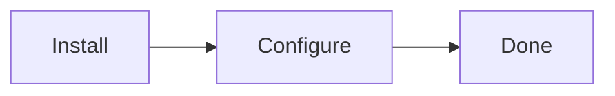

# Dev Guide — Product Documentation Site

Company standard for building a product user guide.
Start from an empty folder. The one thing you copy from an existing guide is the
shared stylesheet (2.6) — every product guide must look identical, and you do not
design your own.

Three phases:

1. **Setup** — install everything on your machine
2. **Build** — write the guide locally and preview it until you are happy
3. **Publish** — put it on git and take it live

---

# PHASE 1 — SETUP

## 1.1 Requirements

| Tool | Version | Check |
|---|---|---|
| Node | 22 | `node -v` |
| npm | 10.x | `npm -v` |
| git | any | `git --version` |

npm only. Not pnpm, not yarn.

## 1.2 Create the project

```bash
mkdir my-product-docs
cd my-product-docs
npm init -y
```

## 1.3 Add `.npmrc`

```bash
echo "legacy-peer-deps=true" > .npmrc
```

**This is mandatory.** VuePress 2 is still a release candidate and its packages
have peer-dependency conflicts. Without this file, install fails.

## 1.4 Install dependencies

```bash
npm i -D --save-exact \
  vuepress@2.0.0-rc.20 \
  @vuepress/bundler-webpack@2.0.0-rc.20 \
  @vuepress/theme-default@2.0.0-rc.88 \
  @vuepress/plugin-search@2.0.0-rc.86 \
  vuepress-plugin-md-enhance@2.0.0-rc.72 \
  vue@3.5.32 \
  mermaid@11.14.0 \
  sass-embedded@1.99.0 \
  sass-loader@16.0.7
```

| Package | Job |
|---|---|
| `vuepress` | the core engine |
| `@vuepress/bundler-webpack` | compiles the site — **must match core version** |
| `@vuepress/theme-default` | the look: navbar, sidebar, dark mode |
| `@vuepress/plugin-search` | search box |
| `vuepress-plugin-md-enhance` | tip boxes, mermaid diagrams |
| `vue` | required by VuePress |
| `mermaid` | diagram rendering |
| `sass-embedded` + `sass-loader` | SCSS support |

**Company rule: use these exact versions.** `--save-exact` writes them without a
`^`, so every developer gets an identical build. Do not run `npm-check-updates`.

## 1.5 Add scripts

Open `package.json`. Add `"type": "module"` and replace `scripts`:

```json
{
  "type": "module",
  "scripts": {
    "start": "vuepress dev docs --clean-cache --clean-temp -p 8080",
    "build": "vuepress build docs --clean-cache --clean-temp",
    "clean": "rm -rf docs/.vuepress/.cache docs/.vuepress/.temp docs/.vuepress/dist"
  }
}
```

| Script | Use |
|---|---|
| `npm start` | dev server while writing |
| `npm run build` | produce the real site |
| `npm run clean` | wipe caches when something looks stale |

---

# PHASE 2 — BUILD LOCALLY

## 2.1 The structure — standard for every product

Create this:

```
my-product-docs/
├─ package.json           dependencies + scripts
├─ package-lock.json      exact versions (auto-created)
├─ .npmrc                 legacy-peer-deps=true
├─ .gitignore             (added in Phase 3)
│
└─ docs/                  ← EVERYTHING YOU WRITE
   │
   ├─ README.md           the HOME page
   ├─ introduction.md     what the product is
   ├─ requirements.md     what the customer needs first
   ├─ installation.md     how to install
   ├─ activation.md       license / setup
   │
   ├─ configuration/      ← your product's real content
   │  ├─ overview.md
   │  └─ settings.md
   │
   ├─ help/
   │  ├─ troubleshooting.md
   │  └─ faq.md
   │
   └─ .vuepress/          ← THE ENGINE — not pages
      ├─ config.js        settings, menus, sidebar
      ├─ client.js        optional — breadcrumb, "On this page", copy buttons
      ├─ styles/
      │  ├─ palette.scss  design tokens — colors, sidebar width
      │  └─ index.scss    the house look — copied, never written by hand
      └─ public/          static files served at the site root
         ├─ favicon.ico
         └─ images/       all screenshots
```

Create the folders:

```bash
mkdir -p docs/.vuepress/public/images docs/.vuepress/styles docs/help
```

### The rule that explains the whole layout

> **`docs/` is your content. `docs/.vuepress/` is the machine that renders it.**

| I want to... | Edit |
|---|---|
| Add a page | new `.md` file inside `docs/` |
| Change left menu | `docs/.vuepress/config.js` → `sidebar` |
| Change top menu | `docs/.vuepress/config.js` → `navbar` |
| Change title / SEO | `docs/.vuepress/config.js` → `title`, `description` |
| Add an image | drop it into `docs/.vuepress/public/images/` |
| Change a colour | `docs/.vuepress/styles/palette.scss` |
| Restyle a component | `docs/.vuepress/styles/index.scss` — and see 2.6 first |

### File path becomes the URL

```
docs/introduction.md          →  /introduction
docs/help/faq.md              →  /help/faq
docs/configuration/setup.md   →  /configuration/setup
```

`docs/README.md` is special — it is the home page at `/`.

Anything in `public/` is served from the root:
`public/images/logo.png` → `/images/logo.png`.

### Standard page set

Every product guide must have these. Consistency across products matters more
than creativity here.

```
introduction.md      what it does, who it is for
requirements.md      versions, prerequisites
installation.md      step by step install
activation.md        license key / enabling it
help/troubleshooting.md
help/faq.md
```

Everything else is product-specific and goes in your own folders.

## 2.2 Write the config — `docs/.vuepress/config.js`

This one file controls the entire site.

```js
import { defineUserConfig } from "vuepress";
import { defaultTheme } from "@vuepress/theme-default";
import { webpackBundler } from "@vuepress/bundler-webpack";
import { searchPlugin } from "@vuepress/plugin-search";
import { mdEnhancePlugin } from "vuepress-plugin-md-enhance";

export default defineUserConfig({
  // Leave this exactly as-is. It is "/" locally, and the docs hub
  // automatically injects "/my-product/" when it builds. Hardcoding
  // "/" here breaks every image and link on the live site.
  base: process.env.VUEPRESS_BASE || "/",

  lang: "en-US",
  title: "My Product",
  description: "User guide for installing and configuring My Product.",

  head: [
    ["link", { rel: "icon", href: "/favicon.ico" }],
  ],

  bundler: webpackBundler(),

  theme: defaultTheme({
    logo: "/images/logo.png",

    // company standard — keep these off
    repo: null,
    editLink: false,
    lastUpdated: false,
    contributors: false,

    navbar: [
      { text: "Live Demo", link: "https://example.com/demo" },
      { text: "Buy Now",   link: "https://example.com/buy" },
      { text: "Support",   link: "https://example.com/support" },
    ],

    sidebar: {
      "/": [
        {
          text: "Getting Started",
          collapsible: false,
          children: [
            { text: "Introduction",       link: "/introduction" },
            { text: "Requirements",       link: "/requirements" },
            { text: "Installation",       link: "/installation" },
            { text: "Activate & Connect", link: "/activation" },
          ],
        },
        {
          text: "Configuration",
          collapsible: true,
          children: [
            { text: "Overview", link: "/configuration/overview" },
            { text: "Settings", link: "/configuration/settings" },
          ],
        },
        {
          text: "Help",
          collapsible: false,
          children: [
            { text: "Troubleshooting", link: "/help/troubleshooting" },
            { text: "FAQ",             link: "/help/faq" },
          ],
        },
      ],
    },
  }),

  plugins: [
    searchPlugin({ maxSuggestions: 10 }),
    mdEnhancePlugin({ mermaid: true }),
  ],
});
```

**About the sidebar — the #1 mistake:**

- It is manual. A page you create but do not list here is **invisible**.
- Links have no `.md` extension.
- **Standard order: Getting Started → your sections → Help.** Keep the first and
  last group the same in every product guide.
- `collapsible: false` for short groups, `true` for long ones.

## 2.3 Write the home page — `docs/README.md`

Frontmatter only. No body text.

```yaml
---
home: true
heroImage: /images/logo.png
heroText: My Product
tagline: One line about what the product does.
actions:
  - text: Get Started
    link: /introduction
    type: primary
  - text: Live Demo
    link: https://example.com/demo
    type: secondary
features:
  - title: Easy Setup
    details: Install in under five minutes.
  - title: Fully Configurable
    details: Control everything from the admin panel.
  - title: Well Documented
    details: Step-by-step guides with screenshots.
---
```

## 2.4 Write the pages

Plain Markdown. Extras available:

**Callout boxes**

```md
::: tip
Helpful note.
:::

::: warning
Be careful here.
:::

::: danger
This will break things.
:::
```

**Diagrams**

````md

````

**Writing standard**

- One task per page
- Numbered steps for anything procedural
- A screenshot for every admin screen you mention
- Short sentences

## 2.5 Images

Put them in `docs/.vuepress/public/images/` and reference them like this:

```md

```

**Two rules:**

1. **Path must start with `/`.** Never `../images/…` — it works locally and
   breaks on the live site.
2. **Use WebP.** Much smaller than PNG. Ship two sizes: `settings.webp` (full)
   and `settings@1x.webp` (half).

## 2.6 Styling — `docs/.vuepress/styles/`

Every product guide ships the same look: the Vercel-style neutral theme used by
`hyva-jewelry-theme`. Consistency across products is the point — do not restyle.

Two files, and they are **not** interchangeable:

| File | When it loads | What belongs in it |
|---|---|---|
| `palette.scss` | **before** the theme's own CSS | design tokens only — `--vp-c-*` variables |
| `index.scss` | **after** the theme's own CSS | component rules that override the theme |

That load order is the entire reason there are two files. A component rule written
into `palette.scss` is emitted before the theme's own rules and loses to them. The
build passes, the page just ignores you.

### Step 1 — copy the stylesheet

`index.scss` is ~4,700 lines. Nobody writes it by hand. Take it from the reference
guide (you cloned the hub in 3.2; do that first if you have not):

```bash
cp ~/magento-doc/hyva-jewelry-theme/docs/.vuepress/styles/index.scss \
   docs/.vuepress/styles/index.scss
```

It carries no product-specific selectors, so it transplants as-is. Its icons are
inline data URIs. It does pull **Geist** and **Inter** from Google Fonts — the one
external request in the build.

### Step 2 — the palette, verbatim

```scss
/* ===== Vercel-style neutral palette ===== */
:root {
  /* Accent — near-black for active states & links */
  --vp-c-accent: #111111;
  --vp-c-accent-bg: #111111;
  --vp-c-accent-hover: #555555;
  --vp-c-accent-text: #ffffff;

  /* Backgrounds */
  --vp-c-bg: #ffffff;
  --vp-c-bg-alt: #fafafa;
  --vp-c-bg-elv: #ffffff;

  /* Text */
  --vp-c-text: #171717;
  --vp-c-text-mute: #666666;
  --vp-c-text-subtle: #999999;

  /* Borders (hairline) */
  --vp-c-border: #eaeaea;
  --vp-c-border-dark: #d4d4d4;
  --vp-c-gutter: #eaeaea;

  --vp-sidebar-width: 256px;
  --sidebar-width: 16.5rem; /* 264px — matches Vercel */
  --sidebar-width-mobile: 14rem;
}

html.dark,
[data-theme='dark'] {
  --vp-c-accent: #ededed;
  --vp-c-accent-bg: #ededed;
  --vp-c-accent-hover: #ffffff;
  --vp-c-accent-text: #000000;

  --vp-c-bg: #000000;
  --vp-c-bg-alt: #0a0a0a;
  --vp-c-bg-elv: #111111;

  --vp-c-text: #ededed;
  --vp-c-text-mute: #a1a1a1;
  --vp-c-text-subtle: #666666;

  --vp-c-border: #2a2a2a;
  --vp-c-border-dark: #3a3a3a;
  --vp-c-gutter: #2a2a2a;
}
```

### Step 3 — set `sidebarDepth: 0`

In `config.js`, inside `defaultTheme({ … })`. The house layout keeps in-page
headings out of the sidebar.

The page looks identical either way — the stylesheet hides those links regardless.
The difference is in the DOM: leave the setting off and the theme still renders
every heading of the open page into the sidebar, and CSS just paints over them.
Set it and the markup is never emitted. Hidden-but-present links still reach
screen readers, so set it.

### Three ways this goes wrong

**Setting only `--vp-c-accent`.** `@vuepress/theme-default` rc.88 fills buttons,
links, and badges from `--vp-c-accent-bg`, `-hover`, and `-text`. Set the one
variable and your accent looks applied in text while every button stays the
theme's default green. Set the whole family.

**Writing only `html.dark`.** rc.88 toggles `data-theme="dark"` on `<html>`;
`html.dark` is the older beta selector and never matches. Dark mode silently does
nothing. Both selectors are in the palette above — keep both.

**Expecting CSS to draw the whole page.** The breadcrumb, the "On this page" rail,
the "Copy page" button, and the ⌘K search badge are built by `client.js` at
runtime. `index.scss` only styles them; without that file those rules match
nothing. Copy it too if you want them:

```bash
cp ~/magento-doc/hyva-jewelry-theme/docs/.vuepress/client.js docs/.vuepress/client.js
```

It needs two extra runtime dependencies:

```bash
npm i --save-exact html2canvas@1.4.1 jspdf@2.5.2
```

Skip it and you still get the correct typography, sidebar, callouts, tables, and
code blocks — just without those four extras.

## 2.7 Preview while writing

```bash
npm start
```

Open `http://localhost:8080`. It reloads as you save. Keep it running.

## 2.8 Test the real build — do not skip

**The dev server and the real build behave differently.** Broken image paths and
bad links pass in `npm start` and fail after building.

```bash
npm run build
npx serve docs/.vuepress/dist
```

Open the printed URL and click through everything:

```
[ ] every page opens, no 404
[ ] every image loads
[ ] every page appears in the sidebar
[ ] search returns results
[ ] dark mode looks right
[ ] mobile width looks right
[ ] all external links work
```

Stale content? `npm run clean && npm run build`

**Only move to Phase 3 once this passes.**

---

# PHASE 3 — GO LIVE

Your guide is finished and tested locally. Now move it into the docs hub
(`magento-doc`). That repo already handles building and deploying — you only
add your folder and register it.

## 3.1 Clean your folder

Delete everything generated. Only source goes in.

```bash
rm -rf node_modules
rm -rf docs/.vuepress/dist docs/.vuepress/.cache docs/.vuepress/.temp
```

## 3.2 Get the docs hub

**First time — clone it:**

```bash
cd ~/
git clone git@github.com:magentowebkul/magento-doc.git
cd magento-doc
```

**Already have it — update it:**

```bash
cd ~/magento-doc
git checkout main
git pull
```

Create a branch before you touch anything:

```bash
git checkout -b docs/my-product
```

## 3.3 Copy your folder in

```bash
cp -r ~/my-product-docs ./my-product
```

**The folder name is your URL.** `my-product` → `/my-product/`.
Use lowercase with hyphens. No spaces, no capitals.

Your folder now sits next to the existing guides:

```
magento-doc/
├─ scripts/build-pages.mjs      ← you edit this next
├─ homepage/                    don't touch
├─ google-tag-manager/          another product
├─ hyva-jewelry-theme/          another product
└─ my-product/                  ← yours
```

Confirm nothing generated came along:

```bash
ls my-product                   # no node_modules
ls my-product/docs/.vuepress    # no dist, no .cache, no .temp
```

If any of those exist, delete them now — step 3.1.

## 3.4 Register it — the only edit outside your folder

Open `scripts/build-pages.mjs`. Add one entry to the `products` array:

```js
const products = [
  {
    slug: "hyva-jewelry-theme",
    dir: "hyva-jewelry-theme",
    title: "Magento 2 Hyvä Jewellery Theme",
    description: "User guide for installing, activating, and managing the Hyvä Jewellery Theme.",
  },
  {
    slug: "google-tag-manager",
    dir: "google-tag-manager",
    title: "Magento 2 Google Tag Manager",
    description: "User guide for installing, configuring, and managing the Google Tag Manager extension.",
  },
  {                                    // ← add this
    slug: "my-product",
    dir: "my-product",
    title: "Magento 2 My Product",
    description: "User guide for installing and configuring My Product.",
  },
];
```

| Field | What it does |
|---|---|
| `slug` | the URL → `/my-product/` |
| `dir` | your folder name |
| `title` | bold text on the homepage card |
| `description` | grey text under it |

**`slug` and `dir` must be identical.** Nothing checks this. If they differ, the
build passes and every image 404s on the live site.

**Do not edit `homepage/index.html`.** The card is generated from this array.
Array order = card order.

## 3.5 Commit and push

Check what git sees first:

```bash
git status
```

You should see exactly two things: your new `my-product/` folder, and a modified
`scripts/build-pages.mjs`.

```bash
git add .
git commit -m "Add My Product user guide to the docs hub"
git push -u origin docs/my-product
```

Verify the commit has no junk in it:

```bash
git show --stat
```

**Must include:**

```
my-product/package.json
my-product/package-lock.json      required — CI runs `npm ci`
my-product/.npmrc                 required — or CI install fails
my-product/docs/**
scripts/build-pages.mjs
```

**Must NOT include:** `node_modules/`, `dist/`, `.cache/`, `.temp/`

## 3.6 Merge to `main`

Open a PR, get it reviewed, merge.

Merging triggers the pipeline — it builds every product and deploys to Cloudflare.
You never build or upload anything yourself.

Watch it: GitHub → **Actions** → "Deploy Magento Docs". Green = live at
`https://<pages-domain>/my-product/`.