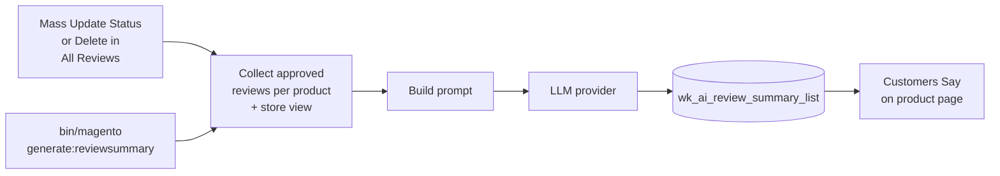

# How It Works

## The pipeline

1. **Something triggers generation** — a mass action on the reviews grid, or the CLI
   command. See [Generating Summaries](./generating/overview.md).
2. **Reviews are collected.** For each product and store view, the module loads every
   **approved** review and joins the review text into one block.
3. **A prompt is built** asking for a single paragraph under 120 words, positives first, in
   the current locale's language. See [What Is Sent to the Model](./generating/prompt.md).
4. **The provider is called** — through Symfony AI for the hosted providers, or with a
   direct HTTP request for Ollama.
5. **The answer is saved** in `wk_ai_review_summary_list`, replacing any earlier summary for
   that product and store view.
6. **The storefront renders it** at the top of the product's **Reviews** tab.

## When nothing happens

Generation is skipped for a product and store view that has **no approved reviews**. Any
older summary stays in the database but is hidden on the storefront, because the page only
shows a summary while the product has at least one approved review.

Next: [Requirements](./installation/requirements.md).
