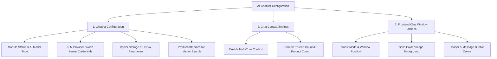

# Configuration Overview

The **Webkul AI ChatBot** extension provides a comprehensive configuration interface under **Stores > Configuration > Webkul > AI ChatBot Configuration**.

The settings are logically organized into three major sections:

## Configuration Sections

| Section | Purpose | Guide |
|---|---|---|
| **1. Chatbot Configuration** | Module status, AI model type, vector storage, and embedding rules | [Chatbot Configuration](/configuration/chatbot-configuration) |
| **2. Chat Context Settings** | Multi-turn conversational memory | [Chat Context Settings](/configuration/chat-context) |
| **3. Frontend Chat Window Options** | Storefront widget styling, placement, and guest access | [Frontend Chat Window Options](/configuration/chat-window-options) |

## How to Use These Pages

Each AI model type has its own guide with the exact field definitions:

- [LLM Provider](/configuration/llm-provider)
- [Pre Configured Model](/configuration/preconfigured-model)
- [Intfloat E5](/configuration/intfloat-e5)
- [Vector Index & Attribute Settings](/configuration/vector-index-settings)