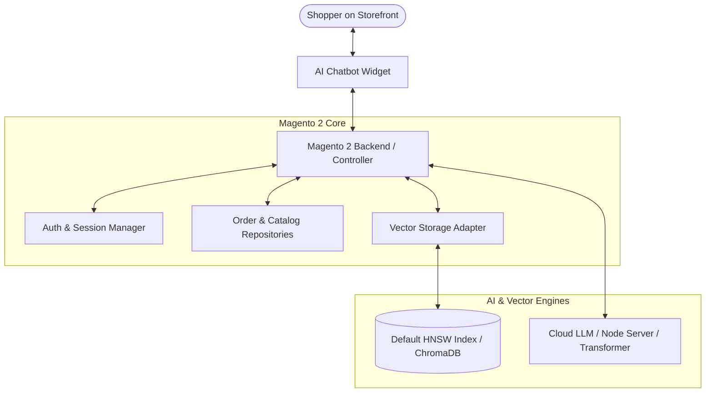

# Introduction

**Webkul AI ChatBot for Magento 2** is an intelligent conversational AI extension designed to transform e-commerce customer experience. It connects your Magento storefront directly with state-of-the-art Large Language Models (LLMs), semantic vector search, and automated store workflows.

With AI ChatBot, shoppers can discover catalog products through conversational inquiries, check real-time order summaries and tracking details, get instant answers to store policies via FAQ embeddings, and submit support tickets directly from the chat window.

---

## Storefront Experience

The extension injects a responsive, customizable chat widget on the storefront. Customers can interact with quick starter prompts, browse catalog recommendations, or converse naturally.

---

## Key Features

- **Multi-Model AI Support**: Seamlessly integrate with cloud LLM providers (OpenAI GPT-4o, Google Gemini, Anthropic Claude, OpenRouter, Cerebras, DeepSeek), dedicated Pre-Configured inference servers, or lightweight Intfloat E5 transformer models.
- **High-Performance Vector Storage**: Leverage built-in HNSW vector indexing or ChromaDB storage for sub-second semantic retrieval across products, FAQs, and CMS pages.
- **Conversational Product Discovery**: Customers can describe what they are looking for in natural language (e.g., *"Show me waterproof hiking backpacks with laptop sleeves"*). The chatbot renders interactive product cards with direct store links, prices, and ratings.
- **Order Lookup & Tracking**: Logged-in customers can browse recent orders, query item summaries, check shipping and tracking numbers, or view detailed billing/shipping breakdowns without navigating away.
- **Customer Issue Reporting**: Built-in *"Report to Admin"* modal enables shoppers to submit support inquiries and issue descriptions directly to the backend.
- **Automated FAQ & Knowledge Retrieval**: Store managers can manage FAQs with store-view scoping. The chatbot automatically indexes and retrieves FAQ answers to resolve customer queries 24/7.
- **Comprehensive Admin Dashboard**: Complete chat transcript logs, issue reporting inbox, FAQ manager, and interactive statistics dashboard for tracking engagement.
- **Tailored UI Branding**: Fully customizable storefront widget with configurable position, avatar icons, solid or image backgrounds, and custom color themes.

---

## Architecture Overview

---

## Next Steps

- Check the [System Requirements](/requirements) before installing.
- Proceed to the [Installation Guide](/installation) for composer commands and setup instructions.
- Follow [Activation](/activation) to enable the extension and access the admin control panel.

