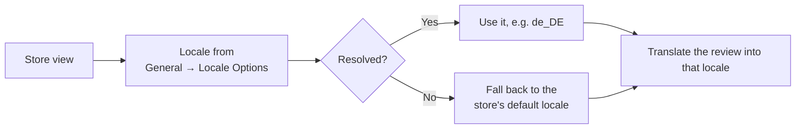

# Store Views & Languages

There is no "target language" field anywhere in the extension. That is deliberate: the
target language is the **locale of the store view**.

## How the language is chosen

Set it at **Stores → Configuration → General → General → Locale Options → Locale**, per
store view.

::: tip Changed a locale? Re-run the bulk command
Existing rows keep the old `language_code`. `php bin/magento Translate:All -s <store-id>`
updates them in place.
:::

## One review, many rows

A translation row is keyed by review **and** store view. A review visible in three store
views produces three rows:

| review_id | store_id | language_code | review_message |
| --- | --- | --- | --- |
| 350 | 1 | `en_US` | This is a sample review… |
| 350 | 2 | `de_DE` | Dies ist eine Beispielbewertung… |
| 350 | 3 | `fr_FR` | Ceci est un avis d'exemple… |

A shopper browsing store view 2 gets the `de_DE` row. See
[Data Model](../developers/data-model.md).

::: warning This multiplies your API calls
Every store view is a separate translation. 350 reviews across 3 store views is 1,050
translations. Use `-s` to limit a bulk run, and turn the module off on store views that do
not need it.
:::

## Per-store-view configuration

Switch the **Scope** picker to a store view, clear **Use Website** / **Use Default** on the
fields you want to override, and save. That lets you:

- Enable translation for `German Store View` and leave `Default Store View` off.
- Point one store view at a stronger model than the rest.
- Use a hosted provider for most views and [Ollama](../providers/ollama/install.md) for one
  where data residency matters.

## English store views

If a store view's locale is `en_US` and the reviews are already English, the model is still
called and still returns text — usually a lightly cleaned-up version. If you do not want
that, turn the module off for that store view or leave it out of the `-s` list.
