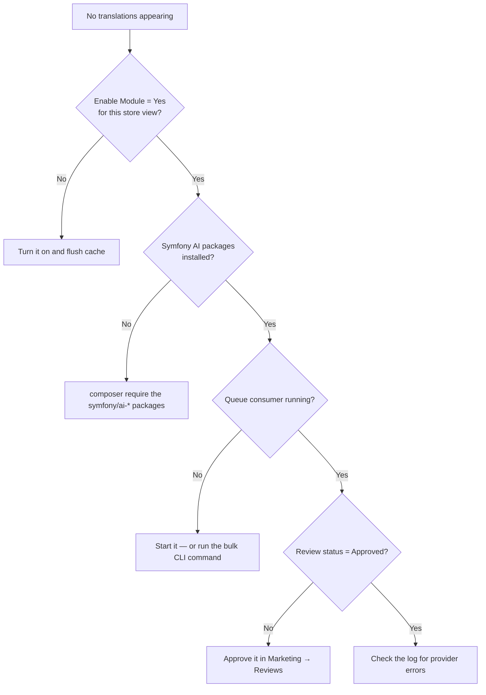

# Setup Problems

Installation and configuration issues. For translations that run but come out wrong, see
[Translation Problems](./translation.md).

## Nothing is being translated at all

Work down this list in order — it is almost always one of the first three.



| Check | Command / place |
| --- | --- |
| Module enabled for this store view | **Stores → Configuration → Webkul → AI Review Translation** |
| AI packages present | `composer show \| grep symfony/ai` |
| Consumer registered | `php bin/magento queue:consumer:list \| grep review` |
| Consumer running | `ps aux \| grep aireview.translation.generate` |
| Review approved | **Marketing → User Content → Reviews** |
| Provider errors | `var/log/aireviewlogger.log` |

## The admin menu is missing

Every menu item depends on `aireviewtranslator/general/status`. An invisible menu means the
module is off, not broken — enable it and flush the cache.

If it is enabled and still missing, the admin role lacks the
`Webkul_AIReviewTranslator::menu` ACL resource. See
[Access Control](../configuration/permissions.md).

## "Missing Symfony AI packages" warning

The LLM bridge packages are not installed. They are Composer `suggest` entries, so nothing
installs them for you. Run the `composer require` block from
[Install the AI Packages](../installation/ai-packages.md), then
`php bin/magento setup:di:compile` and `cache:flush`.

If they *are* installed and the warning persists, check the version — the module needs the
`^0.7` API, and a newer major version moves the bridge classes.

## Validation fails

| Message | Cause | Fix |
| --- | --- | --- |
| *Invalid API Key* | Empty key on a provider that requires one, or the key was rejected. | Re-copy the key; check it is for the right provider. |
| *Unable to validate API key due to a network error.* | Magento cannot reach the provider. | Check outbound HTTPS, proxy settings, egress firewall. |
| *Unable to validate API key for &lt;provider&gt;* | The bridge for that provider is missing. | Install the matching `symfony/ai-*-platform` package. |
| *Provider is required.* | No provider selected. | Pick one and save. |
| *Ollama endpoint is required.* | Ollama selected with an empty endpoint. | Fill in the base URL. |

Ollama-specific failures are on
[Ollama Troubleshooting](../providers/ollama/troubleshooting.md).

::: tip A rate-limit error still validates
If your key is correct but throttled or out of credit, validation succeeds — the module
treats rate-limit, quota, and 429 responses as proof the key works. Translation still fails
until the limit clears. See [How Validation Works](../providers/validation.md).
:::

## The LLM Model dropdown is empty or read-only

It stays read-only until **Validate Key and Load Models** succeeds. If validation succeeds
and the list is still short, that is the capability filter — only text-in / text-out models
are offered.

## After changing configuration, nothing changes

```bash
php bin/magento cache:flush
php bin/magento setup:static-content:deploy   # if you touched frontend files
```

Also restart the queue consumer — it caches configuration at start. See
[Running the Consumer](../translating/queue-production.md).

On a store with a strict CSP, save the LLM host and port first, then
`php bin/magento setup:di:compile`. See
[Content Security Policy](../installation/csp.md).
