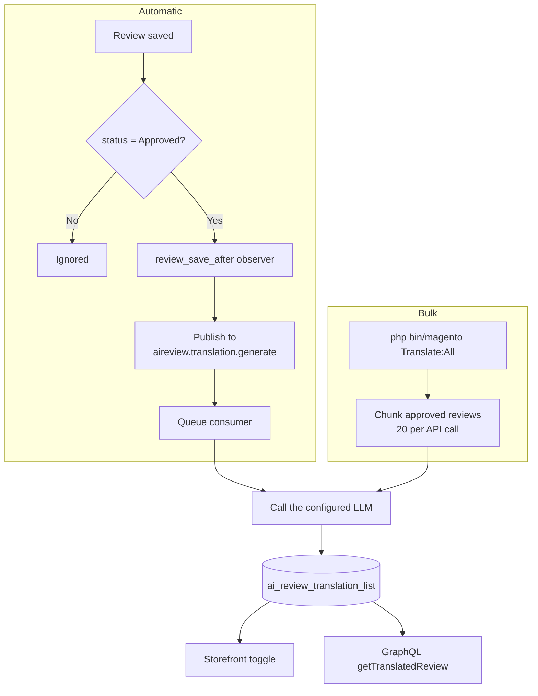

# How It Works

Two paths write into the same table. Everything else in the extension reads from it.

## The two paths

| Path | Triggered by | Use it for |
| --- | --- | --- |
| **Automatic** | Approving a review in the admin | Everyday operation — new reviews translate on their own. |
| **Bulk** | `php bin/magento Translate:All` | Backfilling reviews that already existed, and re-translating after a model change. |

You need both. The observer only fires on save, so reviews approved before you installed
the module were never queued — the bulk command is how you catch up.

## The pieces

| Piece | Name | What it does |
| --- | --- | --- |
| Observer | `review_save_after` | Publishes approved reviews to the queue. |
| Topic / queue | `aireview.translation.generate` | Carries the work. Runs on the `db` connection. |
| Consumer | `aireview.translation.generate` | Calls the LLM and writes the translation. |
| CLI command | `Translate:All` | Batched backfill across store views. |
| Table | `ai_review_translation_list` | One row per review × store view. |
| Log | `var/log/aireviewlogger.log` | Publishes, writes, and provider errors. |

## Where to go next

| You want to… | Start at |
| --- | --- |
| Install it | [Requirements](./installation/requirements.md) |
| Connect a model | [Select an LLM Provider](./setup/provider.md) |
| Understand the LLM call | [What Is Sent to the Model](./translating/prompt.md) |
| Backfill old reviews | [Bulk CLI Command](./translating/cli.md) |
| Query it in code | [GraphQL API](./developers/graphql.md) |
