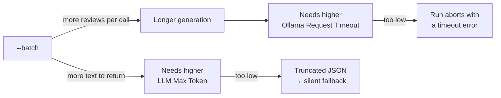

# Timeouts & Batch Size


## Why the timeout is large

**Ollama Request Timeout (seconds)** — minimum 30, default 300.

The request is **non-streaming**: Ollama returns nothing at all until the entire batch has
been generated. So the timeout must cover generating every review in the batch, not one
review.

That is why the default is 300 rather than the 15–30 seconds a normal API call would need.

## Sizing it

| Situation | Suggested timeout |
| --- | --- |
| Small model, default batch of 20, GPU | 300 (default) |
| Large or reasoning model | 600–900 |
| CPU-only inference | 900+ |
| `--batch 50` or higher | Scale roughly with the batch size |

## Lower the batch instead

Raising the timeout forever is the wrong lever. A smaller batch returns sooner:

```bash
php bin/magento Translate:All --batch 5
```

More API calls — but to a local server that costs nothing — and far less likely to time
out. See [Batch Size](../../translating/batch-size.md).

## The three settings interact



A timeout that is too low fails **loudly** — the run stops and prints the store view and
batch number. A token ceiling that is too low fails **silently** — see
[Fallback Behaviour](../../translating/fallbacks.md).

Next: [Ollama Troubleshooting](./troubleshooting.md).
