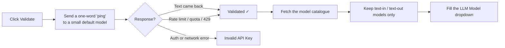

# How Validation Works

**Validate Key and Load Models** is not a format check. It opens a real connection.

## Two consequences

**Validation costs a token or two.** It is a real, minimal API call against a small default
model, not a free metadata lookup.

**A rate-limit or quota error still counts as valid.** If the provider answers with a rate
limit, a quota message, a 429, `resource_exhausted`, or "insufficient balance", the module
treats the key as working — because it clearly is, it is just throttled or out of credit.
You will see **Validated** and translation will still fail until the limit clears.

## Why the model list is shorter than the provider's

After validating, the module asks the provider for its catalogue and filters it. A model
survives only if it declares text input **and** text output. Anything advertising
embeddings, image, audio, speech-to-text, text-to-speech, or video capability is dropped —
none of those can return a translated review.

A provider offering 60 models may show 12 here. That is the filter working, not a fault.

## Ollama validates differently

For Ollama there is no ping. The module calls `/api/tags` on your endpoint and lists what is
installed, adding an `Authorization: Bearer` header only when **Is Authorized** is `Yes`.
See [Connect Ollama](./ollama/connect.md).

## When it fails

Messages and fixes are in [Setup Problems](../help/setup.md).
