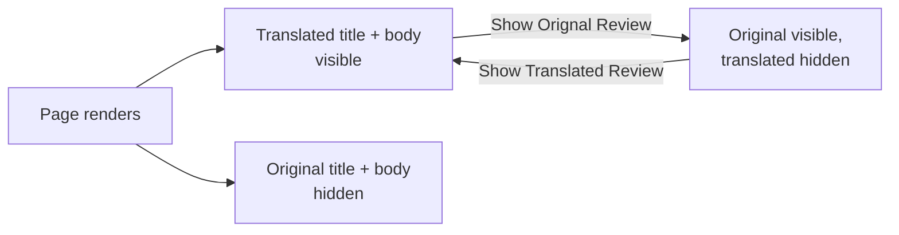

# The Toggle

The link under each review swaps between the customer's words and the translation.

| Link | Effect |
| --- | --- |
| **Show Orignal Review** | Restores the customer's original title and body. |
| **Show Translated Review** | Swaps in the translated title and body. |

Click **Show Orignal Review** and the review flips to the original text:

::: tip That is the module's own spelling
The link really is labelled *Show Orignal Review* in the shipped `en_US` translation file.
To correct it, override the string in your own `i18n` CSV — see
[Translating the Interface](../installation/translations.md#fixing-the-toggle-typo).
:::

## How it works

Both versions are rendered into the page — translated and original, each in its own
container — and the toggle only changes which is visible.

Two consequences:

- Switching is instant. No page reload, no extra request.
- Both texts are in the page source whichever one is showing.

## Structured data

The rendered review keeps Magento's `schema.org/Review` markup, with the visible text in
`itemprop="name"` and `itemprop="description"`.

::: warning Search engines index the translated text
Because the translation renders by default, that is what a crawler sees. Usually what you
want — a German store view indexing German review text — but your rich-result snippets will
show machine-translated wording.
:::

## Which store view's translation

The storefront reads the current store view's ID and looks for a row matching this product,
this review, and this store. No row means no swap. See
[Store Views & Languages](../configuration/scope.md).
