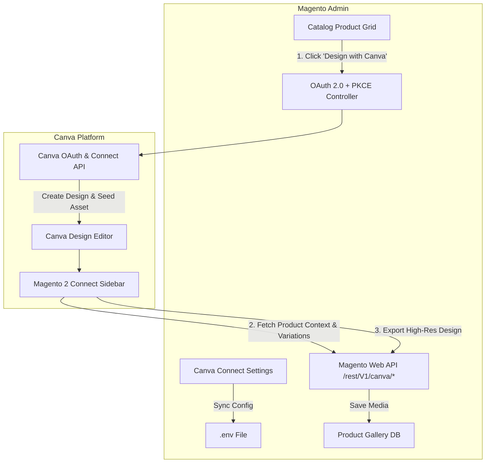

# Introduction

**Magento 2 Canva Connector** by Webkul bridges your Magento 2 e-commerce catalog with Canva's visual design suite. It empowers store administrators, marketing teams, and catalog managers to design product graphics, banner overlays, social promotional cards, and multi-angle product highlights directly inside Canva, and export finished high-resolution artwork into the Magento 2 product gallery with a single click.

---

## Why Canva Connector?

Creating professional e-commerce product graphics traditionally involves downloading images, launching external desktop software, designing assets, exporting files locally, and manually uploading them back into the Magento Admin gallery.

With the **Canva Connector for Magento 2**, this entire cycle is unified:

1. **Direct Launch**: Click **Design with Canva** from any product row in the Magento Admin catalog grid.
2. **Pre-Seeded Canvas**: Magento automatically uploads the product image to Canva assets and opens a new design canvas pre-populated with your product.
3. **In-Editor Product Context**: Open the **Magento 2 Connect** sidebar in Canva to access live product attributes (title, SKU, price, short description) and configurable variations with one click.
4. **Instant Multi-Page Export**: Save single or multi-page designs back to Magento, automatically assigning media roles (`Base Image`, `Small Image`, `Thumbnail`).

---

## Integration Architecture

The extension implements two complementary integration pipelines:

### 1. In-Editor Side Panel (`canva-app-frontend`)
A React 18 & TypeScript side panel operating inside the Canva design editor using the Canva Apps SDK. It communicates securely with Magento REST Web APIs (`/rest/V1/canva/...`) via Canva RS256 JSON Web Tokens (JWT).

### 2. Admin "Design with Canva" Action (`Webkul_CanvaConnector`)
A Magento backend controller communicating server-to-server with Canva Connect REST APIs (`api.canva.com/rest/v1/*`) using OAuth 2.0 Authorization Code Flow with PKCE and rotating refresh tokens.

---

## Key Features

- **One-Click Canva Launch**: Launch Canva design sessions directly from the Magento 2 Product Listing Grid.
- **Automated Asset Uploads**: Automatically packages and uploads product catalog images to Canva assets.
- **Live Catalog Context**: In-editor sidebar detects the active product being edited and surfaces live product details.
- **Configurable Product Variations**: Browse, select, and insert child variation images and pricing directly from the Canva sidebar.
- **Multi-Page Export**: Export multi-page Canva presentations or graphic collections; Page 1 assigns as primary product image while subsequent pages append to the media gallery.
- **Cryptographic Security**: Enterprise-grade security with Canva RS256 JWKS signature verification and PKCE OAuth 2.0.
- **Zero Re-Authentication Hassle**: Rotating refresh tokens ensure administrators stay authenticated without recurring login prompts.
- **Automated Frontend Environment Sync**: Magento Admin configuration automatically generates and updates the frontend Node service `.env` file.
