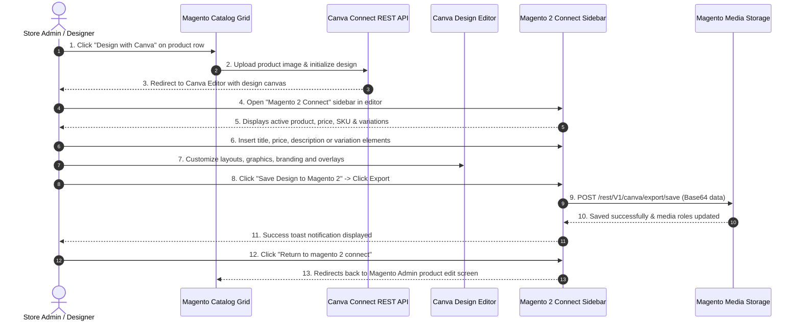

# Design Workflow Overview

The **Magento 2 Canva Connector** delivers an integrated design and publishing loop between Magento Admin and Canva.

---

## End-to-End Sequence

---

## Workflow Stages

1. **[Launch from Product Grid](./design-with-canva.md)**: Trigger design generation directly from Magento Admin catalog grid.
2. **[Canva In-Editor Side Panel](./editor-sidebar.md)**: Browse catalog data, select child product variations, and insert formatted text elements onto the canvas.
3. **[Export & Save to Magento](./export-save.md)**: Export high-resolution artwork from Canva straight into the Magento product gallery and automatically update product roles.
