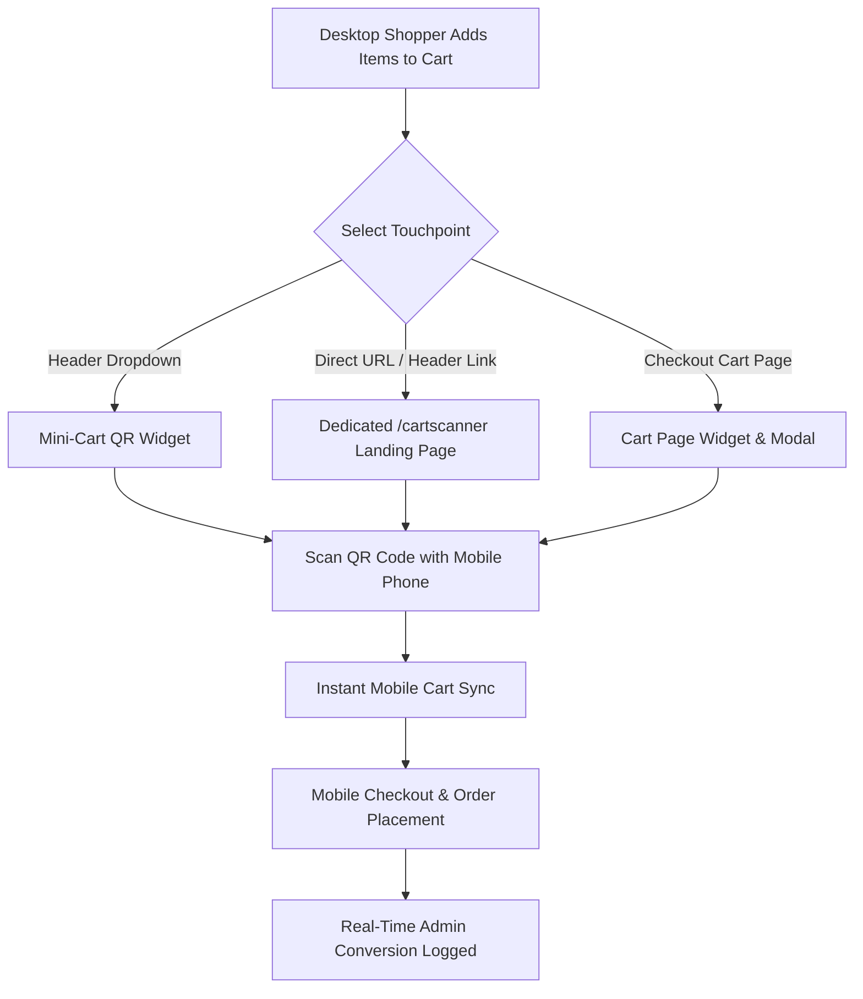

# Storefront Workflow Overview

The **Shopping Cart Scanner** extension provides convenient cross-device shopping touchpoints for desktop and mobile shoppers.

## System Workflow Architecture

## Key Storefront Components

1. **[Mini-Cart QR Widget](/storefront/mini-cart.html):** Quick QR code thumbnail with live countdown timer rendered in header dropdown.
2. **[Dedicated Landing Page](/storefront/landing-page.html):** Clean 2-column layout at `/cartscanner/index/scan` with mobile scan showcase banner.
3. **[Cart Page Widget](/storefront/cart-page-widget.html):** Prominent QR widget on `/checkout/cart` page.
4. **[Enlarged 2-Column Modal](/storefront/enlarged-modal.html):** High-resolution popup with step-by-step onboarding guide and mobile mockup.
5. **[Token Expiration & Refresh](/storefront/token-expiration.html):** Security countdown timer and instant refresh overlay.
6. **[Mobile In-App Scanner](/storefront/mobile-scanner.html):** Dedicated header scanner icon `[▪]` with camera integration.
7. **[Mobile Checkout](/storefront/mobile-checkout.html):** Seamless checkout flow for guest and registered shoppers.
