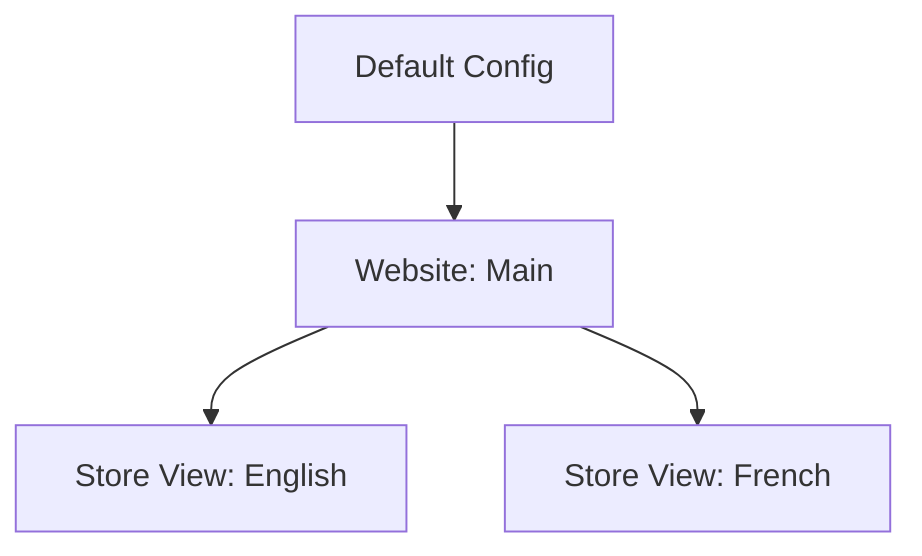

# Overview

All settings live in one place: **Stores → Configuration → Demo Blog**.

## The three groups

| Group | Controls |
|---|---|
| **General** | Turning the blog on, the URL route, listing behaviour |
| **Display** | Layout, image ratio, sidebar widgets |
| **Comments** | Who can comment and whether comments need approval |
| **License** | Activation key and domain — see [Activation](/activation) |


## Turn the blog on

1. Go to **Stores → Configuration → Demo Blog → General**.
2. Set **Enable Blog** to `Yes`.
3. Click **Save Config**.
4. Flush the cache.

Visit `https://your-store.com/blog`. The listing page loads, empty until you
publish your first post.

## Scope: per website and per store view

Every setting has a scope selector in the top-left of the configuration page.



A store view inherits the website value until you uncheck **Use Website** and
set your own.

Typical use:

- **Enable Blog** — set per store view, so the blog runs only in the locales
  where you have content.
- **Blog Title** — set per store view, so it is translated.
- **Blog Route** — keep at default scope unless a locale needs its own word
  (`/blog` vs `/journal`).

::: tip
Change the scope selector *before* you edit a field. Editing at the wrong scope
writes the value to Default Config and every store view inherits it.
:::

## After every change

Configuration is cached. A saved change is not visible on the storefront until
the cache refreshes.


Either click **Flush Magento Cache**, or:

```bash
bin/magento cache:clean config full_page
```

## Next step

Go through the fields one by one in [Settings](/configuration/settings).
