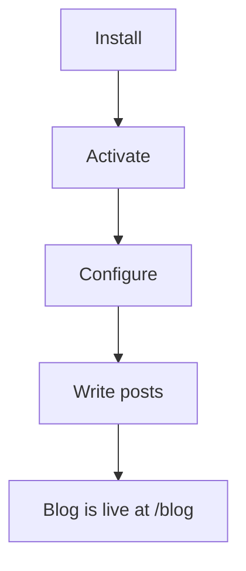

# Introduction

Demo Blog adds a complete blog to your Magento 2 storefront. You write posts in
the admin panel, group them into categories, and readers comment on them. No
second platform to host, no theme to keep in sync.

## What it does

| Feature | Description |
|---|---|
| Posts | Write, schedule, and publish articles with a featured image. |
| Categories | Group posts and give each group its own listing page. |
| Comments | Collect reader comments, with optional moderation. |
| Sidebar widgets | Show categories, recent posts, and search next to your content. |
| SEO fields | Per-post URL key, meta title, and meta description. |
| Store views | Enable the blog per store view and translate the labels. |

## Who it is for

- **Merchants** who want content marketing on the same domain as the store.
- **Content editors** who should never need a developer to publish a post.
- **Developers** who want blog templates that follow the store's existing theme.

## How it fits together



::: tip
Reading this guide end to end takes about fifteen minutes. If the extension is
already installed and activated, skip to
[Configuration → Overview](/configuration/overview).
:::

## Where the blog appears

Once enabled, the blog is served from your store's base URL plus the blog route:

```
https://www.example.com/blog                        listing
https://www.example.com/blog/guides                 category
https://www.example.com/blog/spring-collection      single post
```

The route is configurable — see [Settings](/configuration/settings).

## Next step

Check that your store meets the [Requirements](/requirements).
