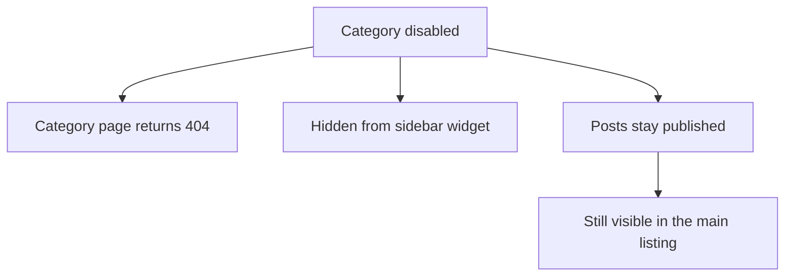

# Categories

A category groups posts and gets its own listing page at
`/blog/<category-url-key>`.

## Create a category

1. Go to **Demo Blog → Categories**.
2. Click **Add New Category**.
3. Enter a **Name**.
4. Check the **URL Key** — it is generated from the name.
5. Set **Status** to `Enabled`.
6. Set **Position** to control the order in the sidebar.
7. Click **Save Category**.

## Fields

| Field | Required | Notes |
|---|---|---|
| Name | Yes | Shown in the sidebar widget and as the page heading. |
| URL Key | Yes | Must be unique, and must not clash with a post URL key. |
| Description | No | Intro text above the category listing. |
| Position | No | Ascending. Use gaps of 10 so you can insert later. |
| Status | Yes | `Disabled` hides the category and its listing page. |
| Store Views | Yes | Which store views show the category. |

::: warning
A category URL key and a post URL key share the same namespace. If a category is
`guides` and a post is also `guides`, the category wins and the post is
unreachable. Keep them distinct.
:::

## Assign posts

Two ways:

- **From the post** — open the post, pick categories under **Post Details**.
- **In bulk** — in **Demo Blog → Posts**, tick the rows, then
  **Actions → Assign Category**.

A post can belong to several categories. It appears in each listing and counts
once in each post count.

## What happens when you disable a category

Disabling a category never unpublishes its posts.

## Deleting a category

Tick the row, then **Actions → Delete**. Posts are not deleted — they lose the
assignment. A post left with no categories still appears in the main listing.

::: tip
Keep the list short. Six to eight categories is usually enough; beyond that
readers use search instead of browsing.
:::

## Next step

Handle reader replies in [Comments](/managing-content/comments).
