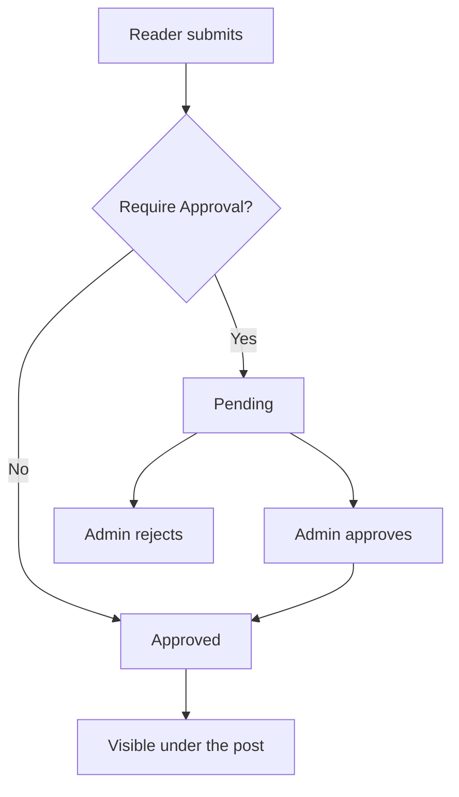

# Comments

Reader comments arrive under **Demo Blog → Comments**. With **Require Approval**
on, nothing is published until you approve it.

## Approve a comment

1. Go to **Demo Blog → Comments**.
2. Filter **Status** to `Pending`.
3. Read the comment text in the grid, or click the row to open it in full.
4. Tick the rows you want to publish.
5. Click **Approve**.

Approved comments appear under the post immediately after the page cache
refreshes.

## Statuses

| Status | Meaning |
|---|---|
| Pending | Submitted, waiting for a decision. Not visible to readers. |
| Approved | Published under the post. |
| Rejected | Kept in the grid, never shown. Use this instead of deleting. |

::: tip
Reject rather than delete. A rejected comment keeps the email address on record,
so you can spot a repeat spammer.
:::

## The moderation flow

## Reply as the store

Open a comment and use **Admin Reply**. The reply is published under the
original comment, labelled with your store name. It does not need approval.

## Email notifications

With **Notify Admin** on, each new comment sends an email to the address in
**Notification Email**.

::: warning
The email is queued, not sent immediately. It goes out on the next cron run. If
notifications never arrive, check cron before checking your spam folder — see
[Troubleshooting](/help/troubleshooting).
:::

## Turning comments off

- **For the whole blog** — **Stores → Configuration → Demo Blog → Comments**,
  set **Enable Comments** to `No`.
- **For one post** — open the post and set **Allow Comments** to `No`. Existing
  approved comments stay visible; the form disappears.

## Dealing with spam

1. Set **Who Can Comment** to `Logged-in customers`. This alone stops most of it.
2. Keep **Require Approval** on.
3. Reject, do not delete, so the sender is on record.

::: danger
Never approve in bulk without reading. Approved comments render links, and a
single approved spam comment can put outbound links on a page that ranks.
:::

## Next step

If something is not behaving, go to
[Troubleshooting](/help/troubleshooting).
