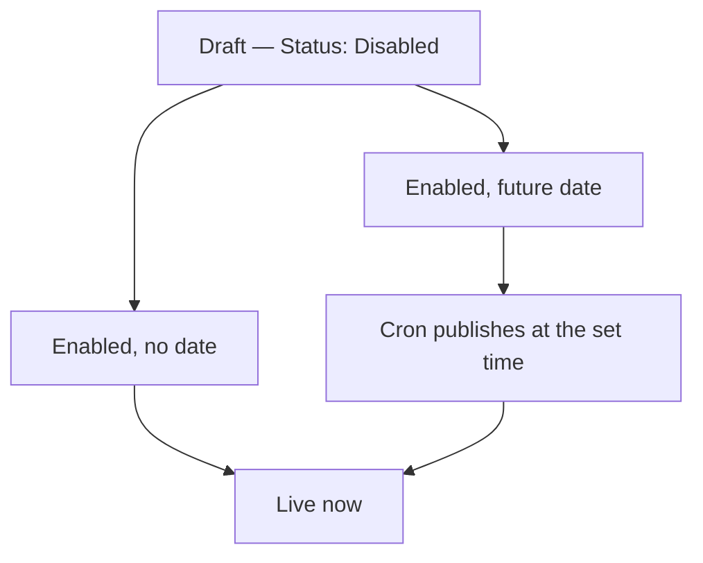

# Posts

Posts live under **Demo Blog → Posts**. The grid lists every post, published or
not.


## Create a post

1. Go to **Demo Blog → Posts**.
2. Click **Add New Post**.
3. Fill in **Title**. The **URL Key** fills itself in — edit it if you want a
   shorter link.
4. Pick one or more **Categories**.
5. Write the body in the **Content** editor.
6. Set **Status** to `Enabled`.
7. Click **Save Post**.


The post is live at `/blog/<url-key>` as soon as the page cache refreshes.

## Fields

| Field | Required | Notes |
|---|---|---|
| Title | Yes | Shown on the listing and as the page `<h1>`. |
| URL Key | Yes | Lowercase, hyphens, no spaces. Must be unique. |
| Categories | No | A post with no category appears only in the main listing. |
| Status | Yes | `Enabled` publishes; `Disabled` returns 404. |
| Publish Date | No | Leave empty to publish immediately. |
| Featured Image | No | Cropped to the ratio set in [Settings](/configuration/settings). |
| Short Description | No | Listing excerpt. Falls back to the first 160 characters. |
| Meta Title | No | Defaults to the post title. |
| Meta Description | No | Defaults to the short description. |
| Store Views | Yes | Which store views show the post. Defaults to all. |

## Schedule a post

Set **Publish Date** to a future date and time, and set **Status** to `Enabled`.
The post stays hidden until then.

::: warning
Scheduling depends on Magento cron. If cron is not running, a scheduled post
never appears. Confirm with:

```bash
bin/magento cron:run --group=default
```
:::

## Publishing flow



## Edit or unpublish

- **Edit** — click the row, change what you need, **Save Post**.
- **Unpublish** — set **Status** to `Disabled`. The URL returns 404, the content
  is kept.
- **Delete** — tick the row, then **Actions → Delete**. This cannot be undone.

## Bulk actions

Select rows with the checkboxes and use **Actions**:

| Action | Effect |
|---|---|
| Enable | Publishes every selected post. |
| Disable | Unpublishes them. |
| Assign Category | Adds one category to all selected posts. |
| Delete | Permanent. |

::: tip
Filter first, then use **Select All** — it selects everything matching the
current filter, not just the visible page.
:::

## Images inside a post

Use the editor's image button. Files land in `pub/media/demoblog/`. Keep them
under 300 KB and prefer WebP; a listing page loads every thumbnail at once.

## Next step

Organise them with [Categories](/managing-content/categories).
