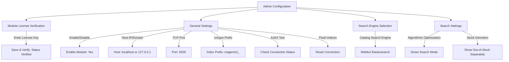

# Admin Configuration

Navigate to **Stores > Configuration > Webkul > Elastic Search Settings** in your Magento Admin Panel.

## Module License

The admin needs to verify the module license to use it properly. Navigate to **Stores > Configuration > Webkul > Module License**.

Here, the admin will find the list of all the licensed modules. For the Elastic Search module, the admin needs to enter the License Key and click on the **Save & Verify** button to verify the license.


---

## 1. Select Search Engine

The next step is to tell Magento to route search queries through the Webkul Elasticsearch engine:

1. Navigate to **Stores > Configuration > Catalog > Catalog Search** in the Magento Admin Panel.
2. Locate the **Search Engine** dropdown.
3. Select **Webkul Elasticsearch**.
4. Click **Save Config**.


---

## 2. General Settings

Next, configure the connection parameters for your Elasticsearch cluster:

Navigate to **Stores > Configuration > Webkul > Elastic Search Settings > General Settings**.




### Configuration Fields

- **Enable Module**: Set to **Yes** to activate Elasticsearch indexing and querying.
- **Host**: Enter the hostname or IP address of your Elasticsearch server (e.g., `localhost` or `127.0.0.1`).
- **Port Number**: Enter the HTTP/REST port for Elasticsearch (default: `9200`).
- **Index Prefix**: Enter a unique prefix for your indices (e.g., `wk_store1_`).
  > [!TIP]
  > When sharing a single Elasticsearch cluster across multiple Magento websites or testing environments, using distinct index prefixes prevents cross-environment index overwrites during reindexing.
- **Check Connection Status**: Click this button to perform a real-time AJAX ping to your Elasticsearch server. The modal reports the cluster name, Elasticsearch version, and connectivity status.
- **Reset Connection**: Purges all existing Webkul indices and mapping properties on the active Elasticsearch server. Use this if you want to rebuild mappings from scratch.

---

## 3. Search Settings Overview

Under **Stores > Configuration > Webkul > Elastic Search Settings > Search Settings**:

- **Enable Smart Search Mode**:
  - **Yes (Recommended)**: Webkul automatically optimizes search queries and safe tokenization out-of-the-box. Complex Query DSL settings are safely abstracted.
  - **No**: Unlocks manual query configuration, allowing you to fine-tune multi-match types, boolean operators, search fields, minimum match percentages, and pattern replace filters.
- **Show Out-of-Stock Products Separately**:
  - **Yes**: Demotes out-of-stock items, rendering in-stock results first and moving out-of-stock items to a dedicated single-row carousel at the bottom of the page.
  - **No**: Displays in-stock and out-of-stock items in standard mixed relevance ranking.

---

## Configuration Summary Reference

Below is the complete reference of all configuration fields available in Magento Admin under **Stores > Configuration > Webkul > Elastic Search Settings**:

### 1. Module License & Search Engine

| Setting | Description | Recommended / Default |
| :--- | :--- | :--- |
| **Module License** | License key verification required to use the extension. | **Verified** |
| **Search Engine** | Sets Webkul Elasticsearch as the primary catalog search engine. | **Webkul Elasticsearch** |

---

### 2. General Settings

| Setting | Description | Recommended / Default |
| :--- | :--- | :--- |
| **Enable Module** | Activates or disables the Elasticsearch module globally. | **Yes** |
| **Host** | Hostname or IP of the Elasticsearch server (e.g., `localhost`, `127.0.0.1`, or remote server IP). | `localhost` or `127.0.0.1` |
| **Port Number** | HTTP/REST port for Elasticsearch communication. | `9200` |
| **Index Prefix** | Unique prefix prepended to all index names on the cluster to prevent collisions across multi-website setups. | `wk_store1_` |
| **Check Connection Status** | AJAX diagnostic button testing live connectivity, cluster health, node name, and Elasticsearch version. | Click to test |
| **Reset Connection** | Utility action that flushes and removes all Webkul indices and mapping properties from the Elasticsearch server. | Use during reset |

---

### 3. Search Settings — Query & Match Controls

| Setting | Description | Recommended / Default |
| :--- | :--- | :--- |
| **Enable Smart Search Mode** | When enabled (**Yes**), automatically applies optimized search query algorithms and safe tokenization, hiding complex DSL options. | **Yes** |
| **Show Out-of-Stock Products Separately** | Demotes out-of-stock items, keeping in-stock items at top and displaying out-of-stock products in a separate carousel below. | **Yes** |
| **Select Frontend Search Type** | Choose between **Multi Match Query** (searches across configured attributes) and **Simple Match Query** (Name & SKU only). *(Available when Smart Search Mode is No)* | `multi_match` |
| **Select Fields For Multi Search** | Multiselect list of catalog attributes evaluated during multi-search (e.g., `name`, `sku`, `description`, `short_description`). *(Available for Multi Match)* | Name, SKU, Description, Short Description |
| **Select Multi Match Type** | Elasticsearch scoring algorithm: `best_fields`, `most_fields`, `cross_fields`, `phrase`, or `phrase_prefix`. *(Available for Multi Match)* | `best_fields` |
| **Select Operator For Multi Search** | Boolean operator: `AND` (all terms must match) or `OR` (any term matches). *(Available for Multi Match)* | `OR` |
| **Minimum Should Match** | Percentage of query terms that must match (e.g. `75%`) to weed out low-relevance results. *(Available for Multi Match)* | `75%` or empty |
| **Allow Spell Correction in search** | Fuzziness edit distance tolerance: `Level 0` (Exact), `Level 1` (1 edit), `Level 2` (2 edits), or `Auto`. | `Level 1` or `Auto` |

---

### 4. Search Settings — Linguistic & Token Filters

| Setting | Description | Recommended / Default |
| :--- | :--- | :--- |
| **Select Search Filters** | Token filters applied during analysis: `Synonym Filter`, `Elision Filter`, `Lowercase Filter`, `Stop Word Filter`. | Lowercase, Synonym, Stop Word |
| **Enter Comma Separated List Elisions** | Comma-separated list of elision prefixes to strip (e.g. French/Italian `l, d, m, t, s, n, qu`). *(Works with Elision Filter)* | `l, d, m, t, s, n` |
| **Use Stop Words Filter** | Enables or disables the removal of high-frequency noise words (e.g. *and*, *the*, *to*). | **Yes** |
| **Enter Comma Separated List Of Stop Words** | Custom comma-separated stop words. If left empty, Elasticsearch's standard default dictionary is used. | Leave empty or custom words |
| **Select Language Stemmer** | Language stemmer selected per store view locale (English, French, German, Spanish, Arabic, Italian, Dutch, Russian, etc.) to reduce words to their base root. | Match store language |
| **Enter comma separated words to exclude from stemming** | Comma-separated list of product words or brand names to preserve without grammatical root reduction (e.g., `shoes, skis`). | Brand / technical terms |

---

### 5. Search Settings — Character Filters

| Setting | Description | Recommended / Default |
| :--- | :--- | :--- |
| **Select Search Filters (Character Filters)** | Character filters applied prior to tokenization: `HTML strip char filter`, `Mapping Filter`, `Pattern Replace Filter`. | `HTML strip char filter` |
| **Enter Comma Separated List Of Filter Mappings** | Key-value mapping pairs in `key => value` format to standardize characters (e.g., mapping Eastern Arabic numerals `٠ => 0, ١ => 1, ٢ => 2, ٣ => 3`). *(Works with Mapping Filter)* | Language-specific mapping pairs |
| **Enter Pattern** | Regular expression to identify recurring noise, symbols, or formatting in product text (e.g., `(\d+)-(\d+)` for hyphenated part numbers, or `[^\w\s]` to strip special symbols). *(Works with Pattern Replace Filter when Smart Search Mode is No)* | Optional (e.g., `(\d+)-(\d+)`) |
| **Enter Pattern To Replace With Filter Pattern** | Replacement string substituted for regex matches (e.g., `$1$2` to unify hyphenated SKUs so `123-456` matches `123456`, or leave blank to strip matches). *(Works with Pattern Replace Filter)* | Optional (e.g., `$1$2` or empty to strip) |

---

### 6. Product Information Group

| Setting | Description |
| :--- | :--- |
| **Elastic Search Product Information** | Displays installed module version, Webkul release details, and customer support links. |

---

## Saving Configuration

Click **Save Config** in the upper right corner, then clear the Magento cache:

```bash
php bin/magento cache:flush
```
<ExplainCode explanation="Applies newly saved Elasticsearch credentials and search engine configurations immediately." />
