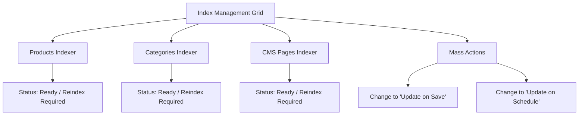

# Index Management & CLI

The **Webkul Magento 2 Elasticsearch** module provides both an interactive Admin UI grid and high-throughput command-line interface (CLI) commands to manage and monitor search indices.

---

## 1. Index Management Admin Grid

Navigate to **Elastic Search > Index Management** in your Magento Admin Panel:




### Grid Capabilities

- **Entity Breakdown**: Monitors three distinct index types:
  1. **Product**: Indexes product catalog attributes, pricing, media, categories, and inventory stock status.
  2. **Category**: Indexes category names, URL keys, breadcrumbs, and product counts.
  3. **Pages**: Indexes CMS pages, titles, identifiers, and content.
- **Status Indicators**:
  - **Ready**: Index is fully synchronized and up to date with the catalog.
  - **Reindex Required**: Database changes have occurred that need to be synchronized to Elasticsearch.
- **Index Mode**:
  - **Update on Save**: Real-time event observers automatically sync changes to Elasticsearch whenever a product, category, or page is saved or deleted.
  - **Update on Schedule**: Changes are queued and processed asynchronously via Magento cron and Mview.
- **Row-Level Reindex**: Click the **Reindex** action button on any row to trigger an immediate sync for that specific entity.

---

## 2. CLI Console Commands

For large catalog bulk updates or deployment automation, use the `bin/magento elastic:index` CLI command:


### Command Syntax

```bash
php bin/magento elastic:index [entity] -a [action]
```

### Supported Entities & Actions

#### Full Reindex (All Entities)
```bash
php bin/magento elastic:index all -a reindex
```
<ExplainCode explanation="Reindexes Products, Categories, and CMS Pages into Elasticsearch in a single execution." />

#### Reindex Specific Entities
```bash
php bin/magento elastic:index product -a reindex
```
<ExplainCode explanation="Reindexes only the catalog product documents into Elasticsearch." />

```bash
php bin/magento elastic:index category -a reindex
```
<ExplainCode explanation="Reindexes only category entities and breadcrumb mappings." />

```bash
php bin/magento elastic:index pages -a reindex
```
<ExplainCode explanation="Reindexes only CMS pages into Elasticsearch." />

#### Delete Indices from Cluster
```bash
php php bin/magento elastic:index all -a remove
```
<ExplainCode explanation="Purges and removes the Webkul indices from the Elasticsearch cluster." />

---

## 3. Automated Background Cron Job

The module registers a scheduled background cron job (`elastic_index_run`) in `etc/crontab.xml`. When indexers are set to **Update on Schedule**, the cron job automatically processes pending changelogs and syncs data to Elasticsearch on a recurring schedule without manual administrator intervention.

To manually trigger Magento cron execution:
```bash
php bin/magento cron:run
```
<ExplainCode explanation="Executes pending cron schedules, including the Webkul elastic_index_run background job." />
