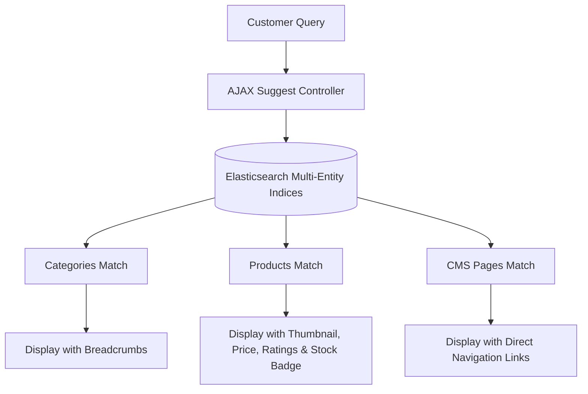

# Multi-Entity Search

The **Webkul Magento 2 Elasticsearch** module delivers a high-speed, interactive storefront search experience through unified multi-entity indexing and debounced AJAX based search suggestions.

Instead of only searching product names, the search engine indexes **Products**, **Categories**, and **CMS Pages** simultaneously. When a customer enters text into the search bar, the dropdown presents categorized suggestions in real time.

---

## Storefront Search Suggestions Dropdown


Hyva Theme Search Suggestions Dropdown




### 1. Categories Section
- Displays matching catalog categories matching the typed keyword.
- Includes hierarchical breadcrumb paths (e.g., *Men > Tops > Jackets*) so shoppers understand the catalog structure.

### 2. Products Section
- High-visibility product presentation including:
  - **Product Thumbnail Image**: Scaled visual preview of the item.
  - **Product Title**: Matching product names.
  - **Product SKU**: Matching SKU.
  - **Formatted Price**: Currency-formatted price.
  - **Star Review Rating**: Displays customer review stars.
  - **In-Stock Badge**: Indicates immediate purchase availability.

### 3. CMS Pages Section
- Indexes store CMS pages (e.g., *About Us*, *Customer Service*, *Shipping & Returns*, *Privacy Policy*).
- Displays direct clickable links in the search suggestions dropdown, enabling shoppers to find informational content without leaving the search bar.

### 4. "View All Results" Navigation
- At the bottom of the suggestions list, a **View All Results** link shows the total number of matching products and redirects shoppers to the full catalog search results page.

---

To ensure all categories and CMS pages are available in search suggestions:
1. Verify that your categories are set to **Is Active: Yes** and **Include in Menu: Yes**.
2. Ensure that CMS pages have **Status: Enabled**.
3. Run an initial reindex of category and page entities:

```bash
php bin/magento elastic:index category -a reindex
php bin/magento elastic:index pages -a reindex
```
<ExplainCode explanation="Populates the category and CMS page indices in Elasticsearch for immediate discovery." />
