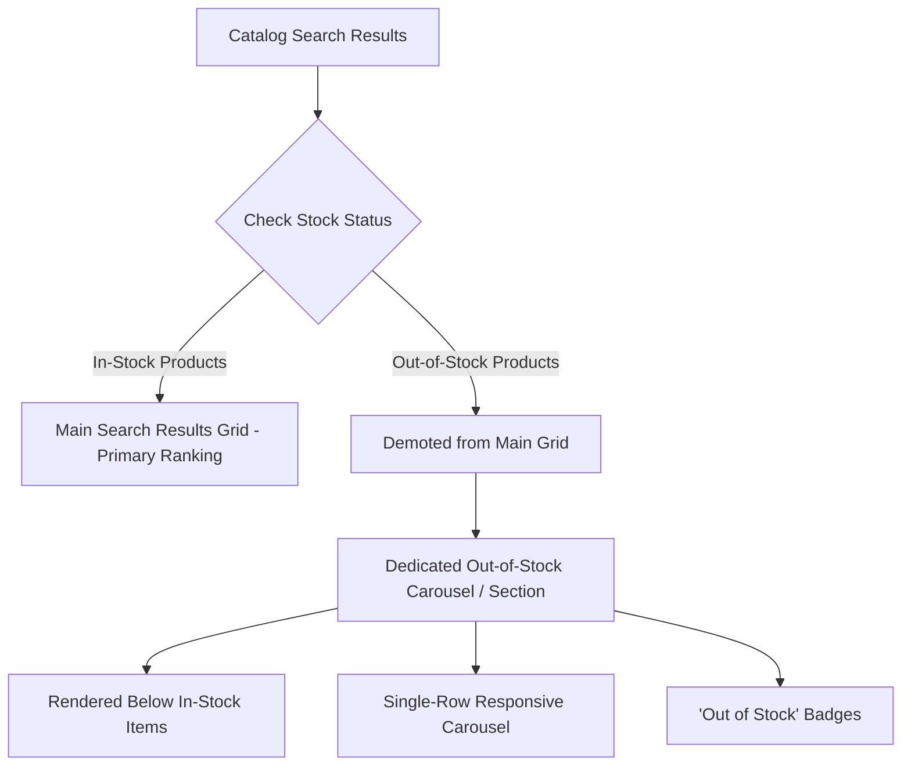

# Out-of-Stock Product Separation

In standard e-commerce search results, out-of-stock products frequently appear near the top of the page if their titles or descriptions have high text relevance. This leads to customer frustration, higher bounce rates, and missed revenue opportunities.

The **Webkul Magento 2 Elasticsearch** module solves this by separating and demoting out-of-stock items, prioritizing purchasable inventory while keeping sold-out products accessible in a dedicated section.

---

## How It Works

Under **Stores > Configuration > Webkul > Elastic Search Settings > Search Settings**, set **Show Out-of-Stock Products Separately** to **Yes**.



### Key Capabilities

1. **Prioritize Purchasable Inventory**:
   In-stock products are guaranteed to appear first in the primary search result grid, ensuring customers see items they can immediately purchase.
2. **Dedicated Out-of-Stock Section**:
   Out-of-stock items are grouped into a clean, dedicated section placed directly underneath in-stock results.
3. **Single-Row Responsive Carousel / Slider**:
   Rather than occupying multiple grid rows, out-of-stock products are organized into an elegant single-row slider with:
   - Next / Previous navigation arrows.
   - Smooth horizontal scrolling on mobile touch devices.
   - Prominent **Out of Stock** badges.
   - Product Name, SKU, Product thumbnails and formatted prices.
4. **Theme Compatibility**:
   - **Luma Theme**: Smooth CSS/JS carousel integration.
   - **Hyvä Theme**: Responsive Alpine.js carousel with Tailwind CSS styling and zero third-party JavaScript dependencies.

---

### Out of Stock Products Separately


### Out of Stock Products Separately Hyva Theme


## Configuration Summary

To enable this feature:
1. Navigate to **Stores > Configuration > Webkul > Elastic Search Settings > Search Settings**.
2. Locate **Show Out-of-Stock Products Separately**.
3. Select **Yes**.
4. Click **Save Config** and clear the Magento cache.


```bash
php bin/magento cache:flush
```
<ExplainCode explanation="Applies out-of-stock collection separation plugin to search result pages." />
