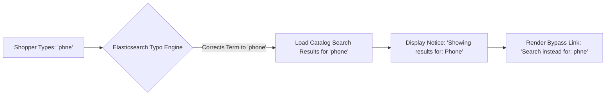

# Spell Correction & "Did You Mean"

Typos and misspelled words are among the leading causes of zero-result search pages in online stores. The **Webkul Magento 2 Elasticsearch** module features intelligent, real-time spell correction powered by Elasticsearch fuzzy matching and phrase suggesters.

---

## Spell Correction in Search (Fuzziness)

Under **Stores > Configuration > Webkul > Elastic Search Settings > Search Settings**, configure the **Allow Spell Correction in search** setting:


Hyva Theme Spell Correction Results


### Fuzziness Levels Explained

- **Level 0 (Exact Match Only)**:
  Disables fuzzy tolerance. Elasticsearch only returns products containing the exact term entered by the shopper.
- **Level 1 (Single Edit Distance)**:
  Tolerates 1 character alteration (insertion, deletion, substitution, or transposition). For example, searching for `"phne"` finds `"phone"`.
- **Level 2 (Two Edit Distances)**:
  Tolerates up to 2 character alterations. For example, searching for `"phonn"` finds `"phone"`. Recommended for stores with complex product names or multi-language shopper bases.
- **Auto (Dynamic Threshold)**:
  Dynamically applies fuzziness based on query string length:
  - 0–2 characters: Exact match only.
  - 3–5 characters: 1 edit allowed.
  - Greater than 5 characters: 2 edits allowed.

---

## Automated Typo Correction Notification

When a shopper enters a misspelled term and Elasticsearch detects a clear high-confidence match, the search engine automatically runs the corrected query and displays an informational notification banner:

```text
Showing results for: Phone
Search instead for: Phne
```



- **Instant Results**: Shoppers are immediately presented with relevant products rather than a discouraging "No results found" screen.
- **Literal Search Bypass**: If the customer genuinely intended to search for their original term (e.g., a proprietary model number or slang), clicking **Search instead for: [Original Term]** bypasses autocorrection and evaluates the literal query.

---

## "Did You Mean" Alternative Suggestions

When a query is ambiguous or produces zero direct matches, the extension provides a **Did You Mean** suggestion box:


Hyva Theme Did You Mean Suggestions


- Recommends nearby vocabulary words indexed from the catalog.
- Displays related product recommendations, keeping shoppers engaged and browsing rather than abandoning the site.
