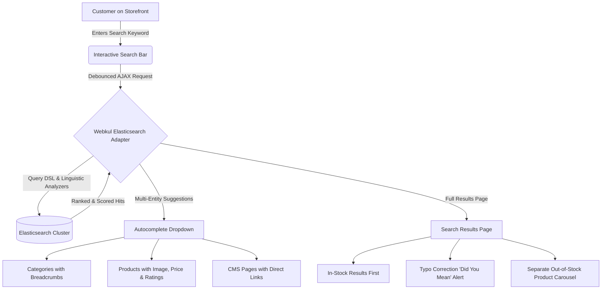

# Introduction

The **Webkul Magento 2 Elasticsearch** extension replaces and supercharges Magento 2's default search capabilities with high-speed, distributed Elasticsearch indexing and querying. Built as a native Magento search engine adapter, it offers lightning-fast catalog search, real-time multi-entity autocomplete dropdowns (Categories, Products, and CMS Pages), automated typo correction, granular Query DSL controls, and intelligent inventory-aware out-of-stock demotion.



---

## Key Highlights

- **Native Search Adapter**: Seamlessly registers as `Webkul Elasticsearch` in `Stores > Configuration > Catalog > Catalog Search > Search Engine`, fully adhering to Magento's official search engine.
- **Multi-Entity Autocomplete**: Storefront customers receive instantaneous, categorized AJAX suggestions for catalog categories (with breadcrumbs), products (with images, prices, star ratings, and stock badges), and CMS pages.
- **Smart Search vs Manual Query DSL**: Store admins can choose between an automated **Smart Search Mode** or take manual command of multi-match query types (`best_fields`, `most_fields`, `cross_fields`, `phrase`, `phrase_prefix`), boolean operators (`AND`/`OR`), and minimum match thresholds.
- **Automated Typo Correction & "Did You Mean"**: Configurable Fuzziness (Levenshtein distance) automatically rectifies misspelled search keywords in real time, displaying *"Showing results for: [Corrected Term]"* alongside a bypass link to retain the original query.
- **Inventory-Aware Out-of-Stock Separation**: Filters out-of-stock products from top search rankings and showcases them in a dedicated single-row carousel below in-stock results to maximize sales conversion.
- **Linguistic Analyzers & Token Filters**: Native integration with Magento's Search Synonyms, Elision article stripping, Lowercase normalization, custom Stop Words filters, and store-specific multilingual language stemmers.
- **Character Filters**: Real-time input sanitization with HTML stripping, character mapping dictionaries (e.g. Eastern Arabic numerals `٠ => 0`), and Regex pattern replacement.
- **Index Management Grid & CLI**: Dedicated admin grid to monitor index status across Products, Categories, and CMS pages, toggle between `Update on Save` and `Update on Schedule`, and run CLI console reindexing (`bin/magento elastic:index`).
- **Hyvä Theme Compatibility**: Fully compatible with [Hyvä Theme](https://www.hyva.io/) via companion package.

---

## Workflow at a Glance

1. **Connection Setup**: The administrator configures the Elasticsearch host, port, and unique index prefix under **Stores > Configuration > Webkul > Elastic Search Settings** and confirms cluster health using the **Check Connection Status** tool.
2. **Search Engine Activation**: Admin selects `Webkul Elasticsearch` under **Stores > Configuration > Catalog > Catalog Search** as the active search engine.
3. **Data Indexing**: Catalog products, categories, and CMS pages are indexed into the Elasticsearch cluster via Admin Index Management or CLI command.

```bash
php bin/magento elastic:index all -a reindex
```
<ExplainCode explanation="Populates the Elasticsearch cluster with initial indices for Products, Categories, and CMS Pages." />

4. **Storefront Discovery**: Shoppers experience real-time autocomplete as they type, receiving immediate suggestions for categories, products, and CMS pages.
5. **Typo Handling & Stock Separation**: If a customer mistypes a product name, the search engine autocorrects the term. Any matching out-of-stock items are automatically demoted and presented in a dedicated carousel below available stock.
