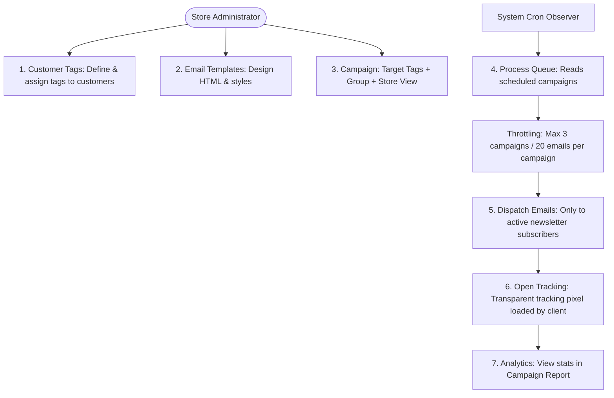

# Introduction

Magento 2 Email Marketing extension allows the admin to manage email templates.

The admin can create and manage Email Templates, Customer Tags, Audiences, and Campaigns depending on the need of the business.

The subscribers will receive Emails. The admin can create multiple templates for Email Marketing and can send them to the customers.

The admin can even create campaigns for sending emails to the subscribers.

---

## Technical Architecture

---

## Key Features & Benefits

* **Create Campaigns**: The admin can create Campaigns.
* **Manage Audience**: The admin can manage the Audience.
* **Customer Tags**: Multiple Customer tags can be created by the admin.
* **Send Marketing Emails**: The admin can send Marketing Emails to multiple customers.
* **Subscription Email**: The customer will get an email when they subscribe.
