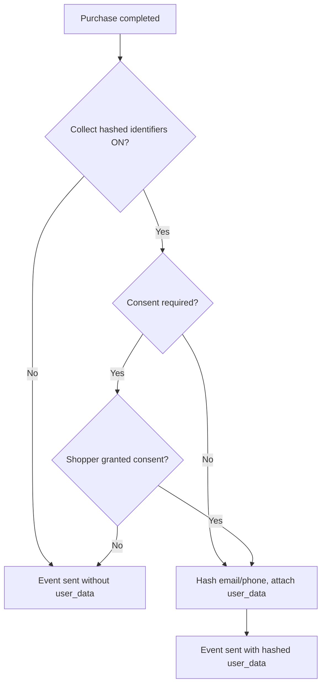

# Consent & PII (GDPR / CCPA)

The **Customer Identifiers and Consent (PII — GDPR / CCPA)** group lets the storefront
attach the buyer's **hashed** identifiers to the purchase event so ad destinations can match
conversions (Google Ads **Enhanced Conversions**). It also controls the consent gate and an
optional cookie banner.

::: danger Personal data — handle with care
These options process personal data, so **GDPR / CCPA apply**. Keep capture **off** unless
you have a lawful basis, and use the consent gate. **Plaintext is never sent** — identifiers
are SHA-256 hashed and normalized in the browser before they reach the dataLayer. You are
responsible for collecting valid customer consent before enabling capture.
:::


## Fields

| Field | Default | What it does |
| --- | --- | --- |
| **Collect hashed customer identifiers** | Off | When on, the purchase event carries SHA-256–hashed, normalized **email** and **phone** as neutral first-party identifiers (`data.user_data`). Google Ads consumes these as Enhanced Conversions to improve match rate. |
| **Also hash name and address** | Off | Additionally hashes billing first/last name and postal address (street, city, region, postcode, country) to improve match rate at the cost of sending more hashed fields. |
| **Require consent before sending identifiers** | On | The consent gate. When on, hashed identifiers are only attached if the shopper has granted consent. Fail-closed: no consent → no identifiers. |
| **Enhanced cookie banner (consent categories)** | Off | Replaces Magento's plain cookie notice with a category-based consent banner that gates Google Tag Manager loading. |

## How the consent gate works

The identifier capture is **fail-closed**: if consent is required and the shopper has not
granted it, the hashed identifiers are simply not attached to the event. Nothing personal
leaves the browser without a positive signal.



## The enhanced cookie banner

Turning on **Enhanced cookie banner** extends Magento's native cookie notice into a
category consent banner. It stores the shopper's choice in a `wkgtm_cookie_consent` cookie
and gates the client-side GTM loader accordingly.

::: tip Full-grant model
Because Magento's Full Page Cache cannot branch per-cookie on the server, the client-side
loader uses a **full-grant model**: Google Tag Manager loads only when the shopper grants
all tracking categories, otherwise it does not load at all. This keeps consent honest under
FPC.
:::

## What is sent — and what is not

- **Sent** (when enabled and consented): SHA-256 hashes of normalized email and phone,
  optionally hashed name/address, under `data.user_data`.
- **Never sent**: plaintext email, phone, name, or address — not to the dataLayer, not to
  the browser, not to any tag.

See Google's [About Enhanced Conversions](https://support.google.com/google-ads/answer/9888656)
for how the hashed identifiers are matched.

After changing consent options, flush the cache:

```bash
php bin/magento cache:flush
```
