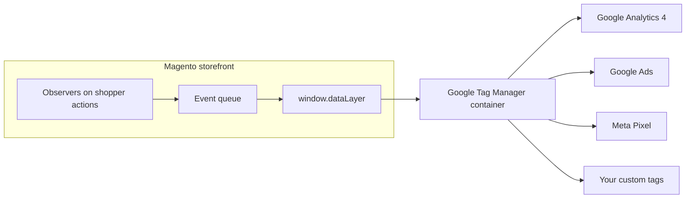

# Configuration Overview

All settings live under **Stores → Configuration → Webkul → Google Tag Manager
Configuration** (section `google_tag_manager`). Settings can be scoped per **Website** and
**Store View**, so a multi-store setup can send different data to different destinations.

## The configuration groups

| Group | What it controls | Guide |
| --- | --- | --- |
| **General** | Master switch, license, GTM Container ID, head/body snippets, test button. | [General Settings](/configuration/general-settings.html) |
| **Shopper Actions to Track** | Which of the 18 events push to the dataLayer. | [Shopper Actions](/configuration/shopper-actions.html) |
| **Tracking Data Tuning** | SKU vs ID, revenue basis, tax/shipping, currency, carrier/payment labels, attribute mapping. | [Data Tuning](/configuration/data-tuning.html) |
| **Customer Identifiers & Consent (PII)** | Hashed identifiers for Enhanced Conversions, consent gate, cookie banner. | [Consent & PII](/configuration/consent-pii.html) |
| **Destinations (Guided Setup — Step 1)** | Enable GA4, Google Ads, Meta Pixel; sGTM server URL. | [Destinations](/destinations/overview.html) |
| **Container Export (Guided Setup — Step 2)** | Download a ready-to-import GTM container. | [Container Export](/destinations/container-export.html) |
| **Developer** | Diagnostics and developer-only toggles. | [Developer](/configuration/developer.html) |

## How the layers fit together



The **storefront** is destination-agnostic — it only knows neutral events. The **container**
translates those events into each vendor's vocabulary. That separation is why you can add a
new marketing tag later without touching Magento at all.

## Recommended order

1. [General Settings](/configuration/general-settings.html) — connect the container.
2. [Shopper Actions to Track](/configuration/shopper-actions.html) — turn on the events you
   want.
3. [Tracking Data Tuning](/configuration/data-tuning.html) — match the data to how you
   report revenue.
4. [Consent & PII](/configuration/consent-pii.html) — only if you need Enhanced
   Conversions or a consent banner.
5. [Destinations](/destinations/overview.html) — only if you are using Guided Setup.

After any configuration change, flush the cache:

```bash
php bin/magento cache:flush
```
