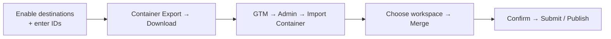

# Container Export

**Container Export** is the last step of Guided Setup. Once you have enabled your
[destinations](/destinations/overview.html) and entered their IDs, download a Google Tag
Manager container that is already wired for exactly those destinations, then import it into
GTM.

## Export and import

1. In the **Container Export (Guided Setup — Step 2)** group, click **Download**. The module
   generates a container `.json` pre-wired for the destinations you enabled (GA4, Google
   Ads, Meta Pixel) with the event mappings from each destination's overrides grid.
2. Go to [tagmanager.google.com](https://tagmanager.google.com) → **Admin → Import
   Container**.
3. Choose the downloaded file, select your workspace, and pick **Merge** (not Overwrite) so
   the import adds to any existing tags rather than replacing them.
4. Review the changes, then **Confirm**.
5. **Submit / Publish** the container version in GTM to take it live.

## What is in the container

The exported container includes the tags, triggers, and variables for each destination you
enabled — for example:

- **GA4** configuration + event tags, with your Measurement ID (and sGTM server URL if set).
- **Google Ads** conversion, remarketing, and dynamic remarketing tags with your Conversion
  ID / Label / Merchant Center ID.
- **Meta Pixel** base + event tags with your Pixel ID.
- Triggers bound to the neutral dataLayer events, and variables that read the event payload.

::: tip Do-It-Yourself? You can ignore this group
If you build tags directly in GTM, skip Container Export entirely. Your storefront already
pushes every event to the dataLayer for your own tags to consume.
:::

::: warning Merge, don't overwrite
Always import with **Merge**. Overwrite replaces your entire workspace and can delete tags
you built by hand.
:::

## Server-side (sGTM)

If you set a **GTM Server Container URL**, the export can include both a **web** container
and a **server** container for your sGTM server. See
[Server-Side Tagging](/sgtm/overview.html).

## Next

[Verify events](/how-to/verify-events.html) in GTM Preview mode to confirm the imported tags
fire on real shopper actions.
