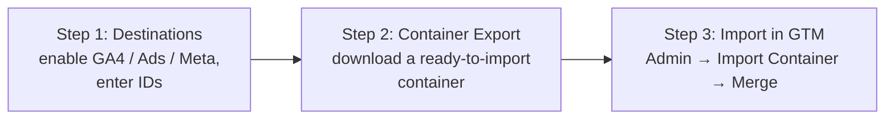

# Destinations — Guided Setup

The **Destinations** group is the start of **Guided Setup** — the path where the module
wires your tags for you instead of you building them by hand in Google Tag Manager.

::: tip You can skip this entire group
If you build your tags directly in Google Tag Manager (**Do-It-Yourself**), leave the
Destinations group untouched. The storefront still pushes every event to `window.dataLayer`
— you just build the tags yourself. Pick **one** path; you do not need both.
:::

## The three-step guided flow

1. **Step 1 — Destinations (this group).** Switch on the destinations you use and enter
   their IDs.
2. **Step 2 — [Container Export](/destinations/container-export.html).** Download a
   container pre-wired for exactly those destinations.
3. **Step 3 — Import.** In [tagmanager.google.com](https://tagmanager.google.com), go to
   **Admin → Import Container → Merge**.

## Destinations you can enable

| Destination | You provide | Guide |
| --- | --- | --- |
| **Google Analytics 4** | Measurement ID (`G-XXXXXXXXXX`) | [GA4](/destinations/google-analytics-4.html) |
| **Google Ads** | Conversion ID, Conversion Label, (optional) Merchant Center ID for dynamic remarketing | [Google Ads](/destinations/google-ads.html) |
| **Meta Pixel** | Pixel ID | [Meta Pixel](/destinations/meta-pixel.html) |

## Server-side tagging (optional)

The Destinations group also holds the **GTM Server Container URL** field. Leave it blank for
standard client-side tracking. To route GA4 through your own server-side GTM server, enter
its URL here — it is stamped onto the exported GA4 tag automatically. See
[Server-Side Tagging](/sgtm/overview.html).

## Event name overrides

GA4 and Meta Pixel each have an **Event name overrides** grid. The first time you enable a
destination, the grid is pre-filled with that destination's default event mappings. You can:

- **Rename** the vendor event name a neutral event maps to.
- **Add a row** to map another supported event.
- **Delete a row** to stop sending that event to the destination.

::: warning Use real vendor event names
The vendor event name you type must be one the platform recognises — a valid GA4 event, or a
real Meta Pixel event such as `Purchase` or `AddToCart`. A name the platform does not
recognise is dropped and will not appear in reports. While a destination is enabled you must
keep **at least one** mapping.
:::

Continue with the destination you use, or jump to
[Container Export](/destinations/container-export.html).
