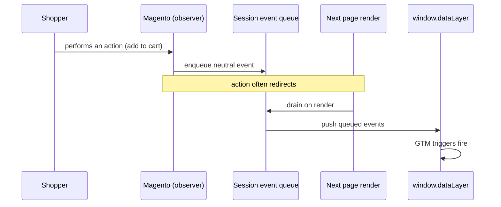

# Events & dataLayer — Overview

Everything the storefront tracks is pushed to `window.dataLayer` as a **neutral event**.
This page explains the shape of those events and how they get there. If you build tags in
GTM yourself, this is your reference for what to bind triggers and variables to.

## The neutral event contract

Layer 2 (the storefront JavaScript) never pushes vendor vocabulary. It pushes neutral event
names through the tracker, for example:

```js
// What the storefront pushes (neutral):
WebkulTracker.pushEvent('cart_item_added', { /* payload */ });

// It never pushes vendor names like this:
// window.dataLayer.push({ event: 'add_to_cart' })   ❌
```

Vendor translation (`add_to_cart`, `AddToCart`, …) happens inside the Google Tag Manager
container, not on the storefront. That is what makes the extension destination-agnostic and
lets you add a new marketing tag later without touching Magento.

## How an event reaches the page



Observers capture the action server-side and place a neutral event on a **session-backed
queue**. On the next render, a view model drains the queue into `window.dataLayer`. This is
why an event from a redirecting action (like add-to-cart) shows up on the page the shopper
lands on.

## Payload shape

Each event carries a top-level `event` name plus a `data` object. Product-bearing events
carry an `items` array. A simplified `product_viewed` looks like:

```json
{
  "event": "product_viewed",
  "data": {
    "currency": "USD",
    "value": 49.00,
    "items": [
      {
        "item_id": "24-MB01",
        "item_name": "Joust Duffle Bag",
        "price": 49.00,
        "quantity": 1
      }
    ]
  }
}
```

- `item_id` is a **SKU** or **numeric ID** depending on
  [Data Tuning](/configuration/data-tuning.html#sku-vs-numeric-id).
- `value` / `currency` follow your
  [revenue basis and currency settings](/configuration/data-tuning.html).
- Extra attributes appear on each item if you configured
  [attribute mapping](/configuration/data-tuning.html#attribute-mapping).
- `data.user_data` (hashed identifiers) appears only when enabled and consented — see
  [Consent & PII](/configuration/consent-pii.html).

## The 18 events

See the grouped pages for payload detail per funnel stage:

- [Category & Search](/events/category.html) — impressions, clicks, search.
- [Product](/events/product.html) — product views, compare, wishlist.
- [Cart & Checkout](/events/cart.html) — cart, checkout steps, purchase.

The complete on/off list lives in
[Shopper Actions to Track](/configuration/shopper-actions.html).

## Inspecting the dataLayer

Open your browser console on the storefront and type:

```js
window.dataLayer
```

You will see the array grow as you browse. For a per-event view with trigger matching, use
[GTM Preview mode](/how-to/verify-events.html).
