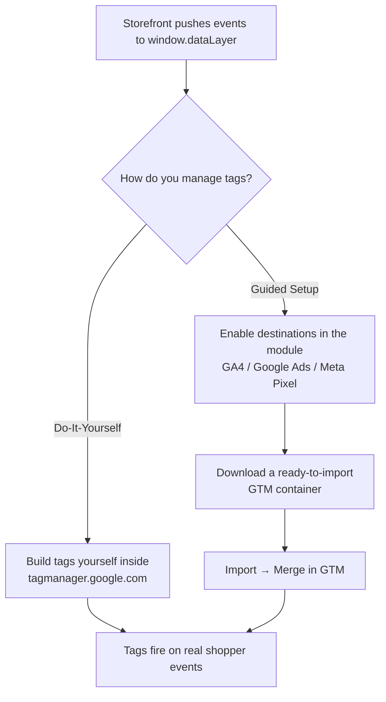

# Magento 2 Google Tag Manager

The **Webkul Magento 2 Google Tag Manager** extension publishes every important shopper
action to `window.dataLayer` and lets you export a ready-to-import Google Tag Manager
container. Install it once, add your GTM Container ID, and your storefront starts sending
clean, structured e-commerce events that any tag — Google Analytics 4, Google Ads, Meta
Pixel, or your own custom tags — can consume.

The extension is **destination-agnostic by design.** The storefront never hard-codes a
vendor: it pushes neutral events like `product_viewed`, `cart_item_added`, and
`payment_completed`. Vendor translation (GA4's `view_item`, Meta's `AddToCart`, and so on)
happens inside Google Tag Manager — either in tags you build yourself, or in the container
this extension can generate for you.

  <a href="https://google-tag-manager-demo-magento2.webkul.in/demomanagement/viewdemo/index/demoid/76/" target="_blank" rel="noopener">Live Demo</a>
  &nbsp;·&nbsp;
  <a href="https://store.webkul.com/Magento2-Google-Tag-Manager.html" target="_blank" rel="noopener">Buy Now</a>

## Two ways to work

You pick **one** path — you do not need both.

- **Do-It-Yourself (DIY).** Add your GTM Container ID, and the storefront pushes every
  event to the dataLayer. You build the tags inside Google Tag Manager. Leave the
  Destinations group untouched.
- **Guided Setup.** Fill in the Destinations group (GA4, Google Ads, Meta Pixel), then
  download a container the module pre-wires for you and import it into GTM. No manual tag
  setup needed.

## What it tracks

Out of the box the extension can track **18 shopper actions** across the whole funnel —
browsing, product views, cart activity, checkout steps, purchases, and account events. Each
one is an on/off toggle. See [Shopper Actions to Track](/configuration/shopper-actions.html)
for the full list and [Events & dataLayer](/events/overview.html) for the payload schema.

## Where to go next

| Area | What it helps you do | Guide |
| --- | --- | --- |
| Requirements | Check your store meets the prerequisites. | [Open requirements](/requirements.html) |
| Installation | Add the extension via Composer and enable it. | [Open installation](/installation.html) |
| Activate & connect | Enter your license and GTM Container ID and go live. | [Open activation](/activation.html) |
| Configuration | Choose which events to track and tune the data. | [Open configuration](/configuration/overview.html) |
| Destinations | Connect GA4, Google Ads, and Meta Pixel. | [Open destinations](/destinations/overview.html) |
| Server-side tagging | Route GA4 through your own sGTM server. | [Open sGTM guide](/sgtm/overview.html) |
| Verify | Confirm events fire in GTM Preview / debug mode. | [Verify events](/how-to/verify-events.html) |

## Quick start

1. Read the [Requirements](/requirements.html).
2. Complete the [Installation](/installation.html).
3. [Activate & connect](/activation.html) — enter your module license and GTM Container ID.
4. Pick your [Shopper Actions to Track](/configuration/shopper-actions.html).
5. Choose a path: build tags in GTM yourself, or use [Guided Setup](/destinations/overview.html) and [export a container](/destinations/container-export.html).
6. [Verify events](/how-to/verify-events.html) in GTM Preview mode.
7. If something looks off, open [Troubleshooting](/help/troubleshooting.html).
