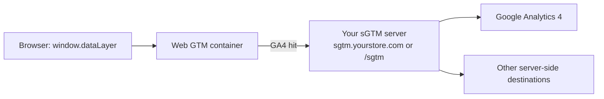

# Server-Side Tagging (sGTM)

Server-side tagging routes your GA4 hits through a **GTM Server container** that you host,
instead of sending them straight from the browser to Google. This gives you first-party
data collection, better control over what leaves your infrastructure, and improved
resilience against ad blockers.

The extension supports sGTM through a single field plus a server-container export — you do
**not** have to hand-edit tags.

::: tip Optional
Server-side tagging is entirely optional. Leave the **GTM Server Container URL** blank for
standard client-side tracking; everything still works.
:::

## How it fits together

The web container sends the GA4 hit to **your** server endpoint; your sGTM server forwards
it to GA4 (and optionally other destinations) from server-side.

## Step 1 — stand up an sGTM server

Set up a server-side GTM server first. Use your storefront's **root domain** so cookies are
first-party — for example `https://sgtm.yourstore.com` or a path like
`https://yourstore.com/sgtm`.

Google's guides:

- [Server-side manual setup guide](https://developers.google.com/tag-platform/tag-manager/server-side/manual-setup-guide)
- [Create a server container](https://developers.google.com/tag-platform/learn/sst-fundamentals/4-sst-setup-container)

The extension supports a **self-hosted sGTM at `/sgtm`** on your storefront domain, which
keeps everything first-party without a separate subdomain.

## Step 2 — enter the server URL

In **Stores → Configuration → Webkul → Google Tag Manager Configuration →
Destinations**, fill in **GTM Server Container URL** with your sGTM endpoint.

On export, this URL is stamped onto the GA4 tag automatically, so the web container knows to
send hits to your server rather than to Google directly.

## Step 3 — export both containers

Enable your [destinations](/destinations/overview.html), then use
[Container Export](/destinations/container-export.html). With a server URL set, the export
provides both a **web** container and a **server** container:

1. Import the **web** container into your normal (web) GTM container — **Merge**.
2. Import the **server** container into your **server** GTM container.
3. Publish both.

## Step 4 — verify

Use [GTM Preview mode](/how-to/verify-events.html) for the web container and your server
container's Preview to confirm the GA4 hit arrives at your server and is forwarded to GA4.
Confirm live traffic in **GA4 → DebugView / Realtime**.

::: warning First-party domain matters
Point the server URL at your storefront's own domain (or a subdomain of it). A third-party
domain loses the first-party cookie benefit that is the main reason to run sGTM.
:::
