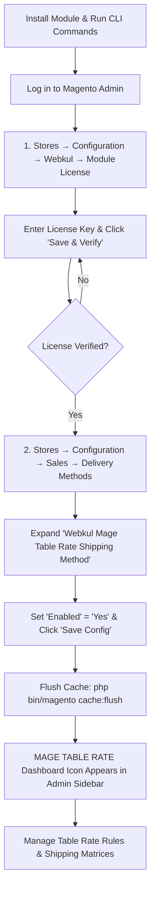
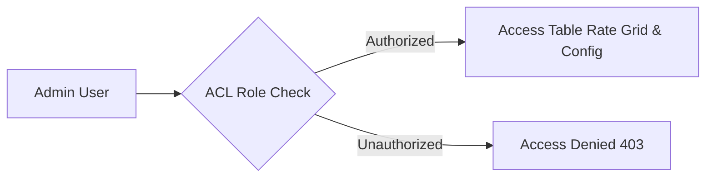

# Activate & Connect

After completing module installation, you must verify its registration, activate your license key, and enable the shipping carrier in store configuration before administrative features and storefront rates become active.

::: important Mage Table Rate Admin Dashboard Icon Visibility
By default, the **Mage Table Rate** dashboard icon will **not** be visible in the Magento Admin left navigation bar immediately after installation. The icon and menu options appear only after completing two required steps:
1. **Module License Verification** under **Stores → Configuration → Webkul → Module License**.
2. **Enabling the Shipping Method** under **Stores → Configuration → Sales → Delivery Methods → Webkul Mage Table Rate Shipping Method**.
:::



## Step 1: Verify Module Status via CLI

Before logging into the admin panel, confirm that the `Webkul_MageTableRate` module is registered and enabled in Magento core via the CLI:

```bash
php bin/magento module:status Webkul_MageTableRate
```

If the module is listed as disabled, enable it and update your store:

```bash
php bin/magento module:enable Webkul_MageTableRate --clear-static-content
php bin/magento setup:upgrade
php bin/magento cache:flush
```

## Step 2: License Verification

The module requires a verified license key before it can be activated in your Magento store:

1. Log in to your **Magento Admin Panel**.
2. In the left admin menu, navigate to **Stores → Configuration**.
3. In the left panel under the **Webkul** tab, click **Module License**.
4. In the **Licensed Modules** section, locate the **Mage Table Rate Shipping** entry.
5. Notice that the initial status displays as **UNVERIFIED**.
6. Enter your valid **License Key** (obtained from your Webkul store account) into the *Enter license key* field.
7. Click the **Save & Verify** button.


8. Once verified successfully, the module status updates to verified, validating your installation.

::: note Where to Find Your License Key
You can retrieve your extension license key by logging into your [Webkul Account](https://store.webkul.com/customer/account/login/) and visiting **My Account → My Purchased Products**.
:::

## Step 3: Enable the Shipping Method in Store Configuration

After completing license verification, you must enable the shipping method from the Magento store delivery settings to activate the rate engine and reveal the admin dashboard icon:

1. In the Magento Admin Panel, navigate to **Stores → Configuration**.
2. In the left navigation panel, expand **Sales** and select **Delivery Methods**.
3. Locate and click to expand the **Webkul Mage Table Rate Shipping Method** (or **Webkul MageTableRate Shipping**) section.
4. Set **Enabled** to **Yes**.
5. Adjust any general carrier parameters if needed (e.g., *Title*, *Method Name*, *Ship to Applicable Countries*).
6. Click the orange **Save Config** button in the top-right corner.
7. Flush the Magento cache:
   ```bash
   php bin/magento cache:flush
   ```

::: tip Carrier Settings Details
For a detailed breakdown of all carrier configuration fields and calculation dimensions, refer to the [Carrier Settings](/configuration/settings) guide.
:::

## Step 4: Access Admin Menu Navigation

Once the license is verified and the carrier is enabled in Delivery Methods, the **MAGE TABLE RATE** icon becomes active and visible in the Magento Admin left navigation bar:

1. Refresh your admin page or navigate to any admin section.
2. Locate the **MAGE TABLE RATE** icon in the main left sidebar navigation.
3. Click the menu to view the management options:
   - **Webkul Table Rate Shipping**: Opens the table rate rules management grid to create, edit, and filter shipping rules.
   - **Configuration Settings**: Direct navigation to view and manage shipping rates configuration.
   - **Support**: Dedicated section providing direct access to Webkul resources, assistance, and extension details:
     - **User Guide**: Direct link to the online documentation and user guides.
     - **Store Extension**: View the official Webkul Store module page for release notes and updates.
     - **Ticket/Customisations**: Open support tickets or submit custom feature inquiries via Webkul UVdesk.
     - **Services**: Explore Webkul's Magento development, migration, and custom development services.
     - **Reviews**: View and submit reviews on the Webkul store.
     - **Version**: Displays the installed module version (e.g., *Version 4.0.3*).


## Step 5: Configure Admin ACL Permissions

If your store utilizes custom or restricted administrative roles, grant access to the Mage Table Rate resources:

1. In the admin panel, navigate to **System → Permissions → User Roles**.
2. Select the role you wish to configure (e.g., *Shipping Managers*).
3. Under **Role Resources**, set *Resource Access* to **Custom** and ensure the following resources are checked:
   - **Mage Table Rate** (`Webkul_MageTableRate::menu`)
   - **Webkul Table Rate Shipping** (`Webkul_MageTableRate::tableratelisting`)
   - **Configuration Settings** (`Webkul_MageTableRate::config`)
   - **Support** (`Webkul_MageTableRate::support`)
4. Click **Save Role**.



::: tip Next Step
With the module verified and enabled, proceed to [Configuration Overview](/configuration/overview) to understand how the shipping rate matrix evaluates shipping rules.
:::
