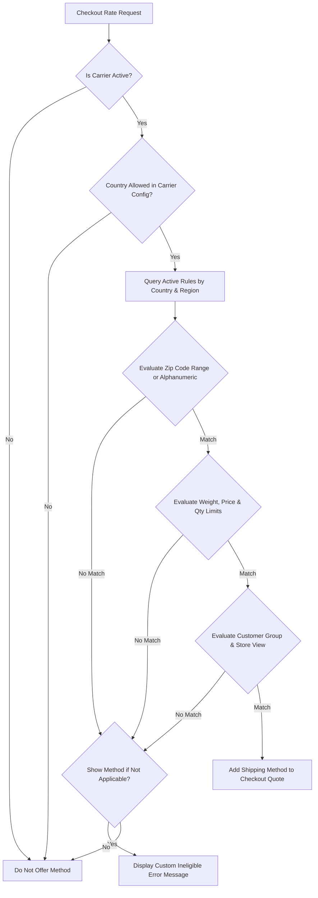

# Configuration Overview

The **Webkul Mage Table Rate** carrier engine provides a robust calculation system that matches incoming checkout conditions against defined shipping matrices.

## How the Rate Engine Evaluates Shipping

When a customer enters their delivery address during checkout or cart estimation, the carrier calculates matching rules through a sequential filter:

## Calculation Factors

Merchants can configure the carrier to evaluate rates based on multiple concurrent criteria:

1. **Geographic Boundaries**
   - **Country**: Matches the customer's 2-letter ISO country code (`US`, `CA`, `GB`, `IN`, etc.).
   - **Region / State**: Matches region ID, state code, region name, or wildcard `*`.
   - **Numeric Zip Code Range**: Compares numeric postal codes between `zip` and `zip_to`.
   - **Alphanumeric Postal Code**: Matches exact or prefix postal patterns (e.g. UK `EC1A`, Canada `H3Z`).

2. **Cart Measurements**
   - **Cart Subtotal**: Evaluates order value against `price_from` and `price_to`.
   - **Package Weight**: Evaluates total quote weight against `weight_from` and `weight_to`.
   - **Item Quantity**: Evaluates total quantity of items in cart against `quantity_from` and `quantity_to`.

3. **Customer & Store Context**
   - **Customer Group**: Targets specific customer groups (e.g., General, Wholesale, VIP, or all via `*`).
   - **Store View**: Restricts specific rules to specific store views (or all via `0` or `*`).
   - **Rule Status**: Enables or disables individual rules dynamically.

## Documentation Sections

- **[Carrier Settings](/configuration/settings)**: Configure global carrier activation, frontend title, applicable countries, and calculation basis.
- **[Table Rate Rules & CSV Import](/configuration/shipping-rules)**: Manage shipping rules, download sample CSVs, bulk import rates, and edit individual rows.
- **[Storefront & Checkout](/configuration/storefront)**: Understand how customers interact with calculated rates during checkout.
- **[GraphQL API](/configuration/graphql)**: Manage shipping methods programmatically in headless and mobile architectures.

::: tip Next Step
Configure global carrier options in [Carrier Settings](/configuration/settings).
:::
