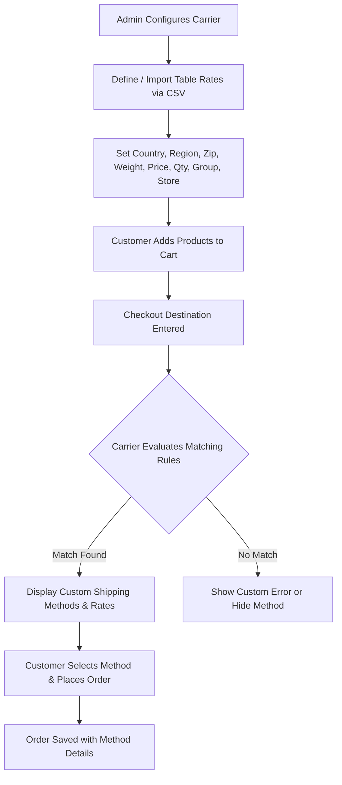

# Introduction

**Magento 2 Multi Shipping Method with Price Range and Zip Range (Mage Table Rate)** empowers store owners to create highly customizable, multi-tier shipping rate tables.

Standard Magento shipping options often fall short when merchants need granular rate tables that combine geographic boundaries, order weights, cart subtotal tiers, item quantities, and customer segmentation. This module bridges that gap by offering matrix-driven shipping calculation with complete administrative control.

## Business Value

1. **Granular Rate Targeting**
   Set distinctive shipping rates for specific geographic zones, including numeric ranges and international alphanumeric postal codes.

2. **Multi-Condition Evaluation**
   Calculate shipping fees based on order cart subtotal, physical parcel weight, total item quantity, or combinations of all three.

3. **Customer Group Segmentation**
   Differentiate shipping offerings between Retail customers, B2B wholesale buyers, VIP members, or guest shoppers.

4. **Store View Specific Rules**
   Run localized shipping strategies tailored specifically for different store views and international storefronts.

5. **Headless & PWA Ready**
   Native GraphQL queries and mutations enable headless storefronts, mobile apps, and external ERPs to query, create, update, and remove shipping rate records.

## Key Features

- **Multi-Shipping Methods**: Define unlimited custom shipping method names (e.g., Standard Delivery, Express Cargo, Same-Day Courier).
- **Bulk CSV Upload**: Efficiently manage thousands of shipping rows using CSV imports and exports.
- **Numeric & Alphanumeric Postal Codes**: Supports numeric ranges (e.g., `90001` to `90100`) as well as alphanumeric patterns (e.g., UK `SW1A`, Canada `K1A 0B1`).
- **Cart Price Tiers**: Establish minimum and maximum order value ranges (`price_from` to `price_to`).
- **Weight Tiers**: Configure minimum and maximum package weight thresholds (`weight_from` to `weight_to`).
- **Item Quantity Tiers**: Apply custom rates based on cart quantity thresholds (`quantity_from` to `quantity_to`).
- **Rule Enable / Disable**: Quickly toggle individual rate rules on or off without deleting entries.
- **Storefront Transparency**: Shows calculated shipping titles and exact costs on the cart, checkout review, and order history pages.
- **GraphQL APIs**: Complete API support for creating, reading, updating, and deleting shipping rules.

::: tip Next Step
Review the technical prerequisites in [Requirements](/requirements) before proceeding with installation.
:::
