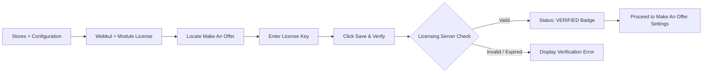
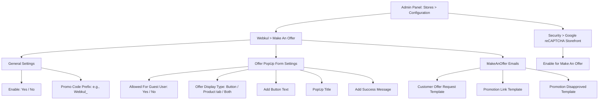

# Configuration

After successfully installing the extension, the store administrator must verify the module license and configure general settings, popup preferences, email templates, and security controls before activating price bargaining across catalog items.

---

## Module License Verification

Before utilizing the extension and activating bargaining on products, the store administrator must verify the module license key. This validates your extension purchase against Webkul's licensing server and authorizes the module on your Magento 2 store instance.

Navigate to **Stores > Configuration > Webkul > Module License** in your Magento Admin Panel.

1. Locate **Make An Offer** under the **Licensed Modules** table.
2. In the **License Key** field, enter the valid license key received with your purchase order.
3. Click the **Save & Verify** button to validate the key against Webkul's licensing server.
4. Once verified, the **Status** column updates to a green **VERIFIED** badge, and a confirmation message is displayed.
5. If you update your store domain, renew your license, or migrate environments, click **Re-verify** at any time to re-validate your license state.




::: note Mandatory License Verification
The extension functionality requires a valid, verified license. Ensure that the **Make An Offer** license status displays **VERIFIED** before configuring and enabling bargaining options.
:::

---

## Accessing Configuration Settings

To access the configuration panel, log in to the Magento Admin Panel and navigate to:
**Stores > Configuration > Webkul > Make An Offer**




---

## Configuration Fields Breakdown

### 1. General Settings

- **Enable**:
  - **Yes**: Activates the Make An Offer module across the storefront, enabling bargaining forms and quote generation.
  - **No**: Completely disables the extension. Product pages render default storefront actions without offer options.
- **Promo code Prefix**: Enter the text prefix that will prepend all auto-generated promotional discount codes (for example: `Webkul_` or `OFFER-`). When an offer is accepted, the system generates codes like `Webkul_XY789K12`.

---

### 2. Offer PopUp Form Settings

- **Allowed For Guest User**:
  - **Yes**: Allows unauthenticated guest visitors to submit offers by providing an email address along with their price quotation.
  - **No**: Restricts offer submissions strictly to registered, logged-in customers.
- **Offer Display Type**:
  - **Button**: Displays an interactive button on the product page (next to *Add to Cart*) that opens a modal popup form.
  - **Product tab**: Injects a dedicated "Make An Offer" tab into the product details tabs section below the product media.
  - **Both**: Enables both the modal popup button and the product info tab simultaneously.
- **Add Button Text**: Specify the label for the storefront offer button (e.g., *Make An Offer* or *Bargain Price*).
- **PopUp Title**: Specify the title header rendered inside the modal popup window.
- **Add Success Message**: Enter the confirmation notification displayed on the storefront immediately after a customer successfully submits an offer (e.g., *Your offer has been submitted successfully!*).

---

### 3. MakeAnOffer Emails

Configure transactional email templates for automated customer communications:

- **Customer Offer Request Template**: Template sent to the shopper immediately after submitting a new offer quotation.
- **Promotion Link Template**: Template dispatched when the store administrator accepts an offer, containing the generated coupon code and direct checkout link.
- **Promotion Disapproved Template**: Template sent when an administrator declines a proposed offer.

---

## Google reCAPTCHA Security Settings

To protect the offer submission form against spam submissions, abuse, and malicious automated bots, configure Google reCAPTCHA:

### Step 1: Open Google reCAPTCHA Settings

Navigate to **Stores > Configuration > Security > Google reCAPTCHA Storefront** (or **Stores > Configuration > Webkul > Security > Google reCAPTCHA Storefront**).


### Step 2: Configure API Credentials

Enter your valid **Google API Website Key** and **Google API Secret Key** obtained from the Google reCAPTCHA console:


### Step 3: Enable for Make An Offer

Under **Storefront**, locate **Enable for Make An Offer** and set it to your preferred reCAPTCHA type (e.g., *reCAPTCHA v2 ("I'm not a robot" Checkbox)* or *Invisible*).


---

## Refreshing Cache After Configuration Changes

Whenever you modify settings under **Stores > Configuration**, refresh the Magento system cache:

```bash
php bin/magento cache:flush
```
<ExplainCode explanation="Flushes Magento's configuration and layout caches so that modified offer settings and reCAPTCHA options become active immediately." />
