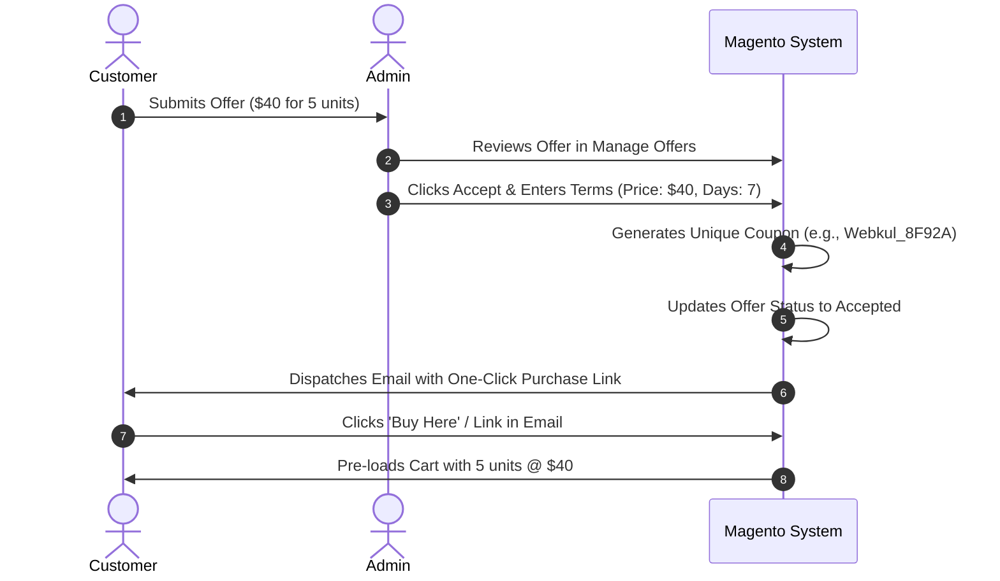

# Manage Offers & Promotions

The **Manage Offers** console is the central hub where store administrators evaluate incoming customer bids, communicate in real time, issue personalized discount coupons, and track negotiation histories.

---

## Accessing the Manage Offers Grid

1. Log in to the Magento Admin Panel.
2. In the left navigation menu, click **Make An Offer**.
3. Select **Manage Offer**.

### Grid Capabilities

- **Offer Overview**: Inspect **ID**, **Product Name**, **Customer Email** (registered or guest), **Offered Price**, **Requested Quantity**, **Status** (Open, Accepted, Rejected), and submission **Created At** timestamp.
- **Search & Filtering**: Filter records by date ranges, customer email, status, or specific product titles.
- **Mass Actions**: Perform bulk deletions using the mass action selector.
- **Action**: Click **View** to inspect offer specifics, customer messages, and promotion generation tools.

---

## Evaluating an Offer

Clicking **View** opens the **Requested Offer Details** dashboard:

At the top of the screen, administrators have immediate access to core decision actions:
- **Accept**: Opens the promotion creation modal to approve the quote.
- **Decline**: Rejects the quotation and sends an automated notification email to the shopper.
- **Back**: Returns to the Manage Offers grid.

---

## Creating a Promotion (Accepting an Offer)

When an administrator decides to accept an offer or establish agreed-upon counter-terms, clicking **Accept** launches the **Create Promotion** modal:

### Promotion Configuration Fields

1. **Per Product Price**: Set the negotiated unit price. By default, this pre-populates with the customer's requested rate, but the admin can adjust it to propose a counter-rate.
2. **Product Qty**: Specify the quantity required to redeem this discounted rate.
3. **Promotion Description**: Enter an optional note explaining the promotion terms.
4. **Number of Days**: Specify how many days the promotional coupon remains valid (e.g., *7 days* or *14 days*). After this window lapses, the coupon automatically expires.

Click **Save** to finalize the promotion.

---

## Customer Email Notification

Upon saving the promotion, the module automatically generates a unique promo code (using the configured prefix) and delivers an email to the customer containing a direct checkout link:

When the customer clicks **Click Here**, their browser redirects directly to the shopping cart with the negotiated price rule activated:

---

## Post-Acceptance Controls & Discussion Blocking

Once an offer has been accepted, administrators retain full control to manage ongoing communication:

- **Edit Offer**: Modify terms or formulate updated counter-proposals.
- **Decline Offer**: Admin can decline a previously accepted offer if stock availability or merchant constraints change.
- **Block Discussion**: Lock the discussion panel to stop incoming messages from abusive or spamming users. If needed, the admin can click **Reopen Discussion** later.

---

## Admin Offer Discussion Panel

Administrators can chat directly with the shopper using the embedded **Offer Discussion** panel located on the offer details page:

- Review customer comments and negotiation justifications.
- Reply directly from the admin panel without relying on external email threads.
- Messages are instantly synchronized to the customer's account view.

---

## Tracking Promotion History

Under the **Requested Offer Details** screen, two dedicated sub-tabs track coupon records:

### 1. Recent Promotions Tab

Displays the currently active promotional code, unit price, quantity threshold, validity period, and expiration date.

### 2. Old Promotions Tab

When an offer is countered, updated, or expires, prior coupons are automatically archived in the **Old Promotions** tab. This provides an audit trail of previous negotiations while preventing reuse of stale coupons.

