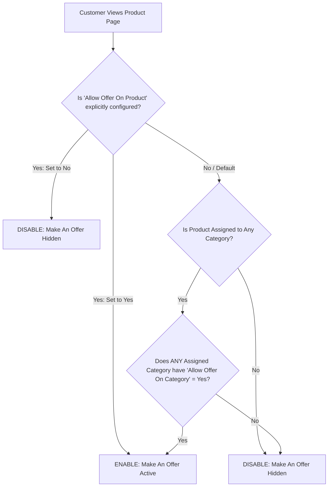

# Product & Category Rules

The **Make An Offer** extension provides flexible catalog-level controls. Merchants can selectively activate bargaining on specific high-margin items or enable price negotiations across entire product categories simultaneously.

---

## Enabling Offers on Individual Products

To enable bargaining on a specific catalog item:

1. Log in to the Magento Admin Panel.
2. Navigate to **Catalog > Products**.
3. Select and edit the target product.
4. Scroll to the **Make An Offer** attribute section.
5. Set **Allow Offer On Product** to **Yes**.
6. Click **Save** in the top-right corner.


---

## Enabling Offers at Category Level

To activate bargaining across all products assigned to a category:

1. Navigate to **Catalog > Categories**.
2. Select the desired category from the category tree.
3. Locate the **Allow Offer On Category** setting.
4. Toggle the option to **Yes**.
5. Click **Save Category**.


---

## Precedence & Hierarchy Rules

When both product-level and category-level configurations exist, the module evaluates offer eligibility based on the following hierarchy:



1. **Product Setting Takes Priority**: The **Allow Offer On Product** setting directly on the product edit screen overrides category-level inheritance.
2. **Multi-Category Inclusion**: If a product belongs to multiple categories and *at least one* assigned category has **Allow Offer On Category** enabled, bargaining will automatically activate for that product (unless explicitly disabled on the product itself).
3. **Inheritance Efficiency**: Store owners can enable offers on a broad category (e.g., *Clearance*) and selectively disable specific non-negotiable products by setting their product-level attribute to **No**.

---

## Product Design Layout for Tab Display

When configuring **Offer Display Type** as `Product tab` (or `Both`) under global configuration, the product detail page must use a layout template that supports Magento's native product information tabs:

1. In the product edit screen, expand the **Design** section.
2. Under **Layout Update**, ensure the setting is configured to default or **No layout updates** so standard tabs render without obstruction.


3. Click **Save** and flush the layout cache:

```bash
php bin/magento cache:flush
```
<ExplainCode explanation="Refreshes layout XML and block caches to render the Make An Offer tab on the product detail page." />

---

## Configurable & Child Products Support

When bargaining is enabled on a **Configurable Product**:
- Shoppers can select attribute options (such as Color and Size) directly within the Make An Offer form.
- The extension dynamically detects child product stock and original retail pricing via AJAX endpoints, ensuring negotiations correspond to the exact SKU and option combination chosen by the customer.
