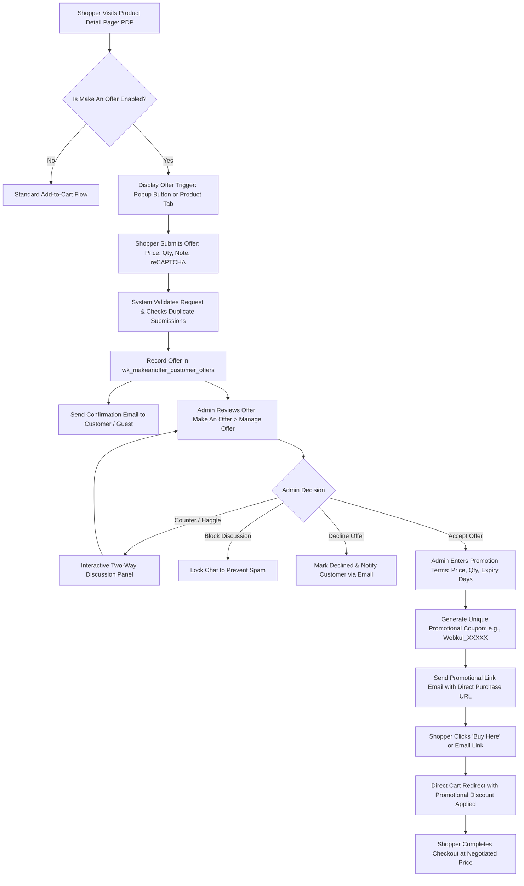

# Introduction

The **Webkul Magento 2 Make An Offer** extension enables eCommerce store merchants to turn fixed product prices into dynamic price negotiations. Customers and guest shoppers can submit custom price offers and requested quantities directly from the storefront, while store administrators can review, accept, decline, or counter each quotation and negotiate in real time through an integrated discussion panel.



---

## Key Highlights

- **Flexible Storefront Placement**: Render the Make An Offer call-to-action as a sleek modal popup button, an inline product information tab, or both simultaneously.
- **Support for Key Product Types**: Native support for **Simple**, **Configurable**, **Virtual**, and **Downloadable** products.
- **Guest Shopper Bargaining**: Allow unauthenticated visitors to place custom price offers by providing their email address, expanding your potential customer acquisition pipeline.
- **Two-Way Discussion**: An interactive messaging panel allows customers and store administrators to haggle, clarify requirements, and negotiate agreeable pricing.
- **Google reCAPTCHA Integration**: Protect your store against automated bot spam by securing offer submission forms with Google reCAPTCHA v2 / v3.
- **Automated Promotional Coupon Generation**: Accepting an offer automatically creates a secure, unique promo code (with an admin-defined prefix) and links it directly to the customer's negotiated quotation.
- **One-Click Cart Checkout Link**: Customers receive an email containing a dedicated purchase link and a "Buy Here" button in their account dashboard that adds the product to their cart at the negotiated promotional price.
- **Expiration Date Controls**: Specify a validity duration (number of days) for accepted promotions. Once expired, old promotions are archived, allowing new bargaining requests.
- **Administrative Control & Spam Protection**: Store owners can decline rejected offers, reopen previously closed negotiations, or block discussions from disruptive accounts.
- **Hyvä Theme Storefront Support**: Blazing-fast frontend compatibility with modern [Hyvä Themes](https://webkul.com/hyva-theme-development/) via the companion module `Webkul_MakeAnOfferHyva`.
- **Headless GraphQL APIs**: Complete GraphQL queries and mutations for headless PWA or native mobile app integrations.

---

## Workflow at a Glance

1. **Global Configuration**: Enable the extension and configure promo code prefixes and popup text under **Stores > Configuration > Webkul > Make An Offer**.
2. **Catalog Activation**: Enable **Allow Offer On Product** on individual products or set **Allow Offer On Category** across entire catalog sections.
3. **Storefront Shopper Submission**: The customer enters their proposed price, desired quantity, and message, completes Google reCAPTCHA, and submits the offer.
4. **Offer Review & Negotiation**: The merchant reviews pending bids under **Make An Offer > Manage Offer**, chats with the customer via the **Offer Discussion** panel, or formulates counter-proposals.
5. **Acceptance & Checkout**: The merchant clicks **Create Promotion**, setting the approved unit price and validity duration. The customer clicks the generated link to checkout with the discount applied.

```bash
php bin/magento setup:upgrade
```
<ExplainCode explanation="Registers Webkul_MakeAnOffer in app/etc/config.php, executes declarative schema patches, and creates customer offer, promotional discount, and chat database tables." />

---

::: tip Conversion Optimization Strategy
Price bargaining transforms high-intent visitors who find standard retail prices too high into purchasing customers. By engaging them in a discussion and delivering personalized, limited-time discount coupons, merchants drastically reduce cart abandonment and foster brand loyalty.
:::
