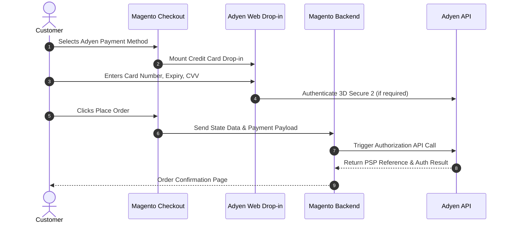

# Payment Workflows

This document outlines the customer-facing payment process, credit card authorization, capture online operations, and credit memo refunds.

---

## 1. Customer Checkout Experience

---

## 2. Payment Capture Operations

Depending on **Payment Action** configured in Admin:

- **Authorize & Capture**: Adyen captures payment immediately upon authorization. Magento automatically creates an invoice with transaction ID set to the Adyen PSP reference.
- **Authorize Only (Manual Capture)**: 
  1. Store Admin navigates to **Sales > Orders > Select Order > Invoice**.
  2. Select **Capture Online** in the invoice creation page.
  3. The module dispatches a capture request payload to Adyen's `/captures` endpoint.
  4. Webhook logs receive `CAPTURE` event and confirm invoice status.

---

## 3. Credit Memo & Refunds

When a customer or admin requests a refund:

1. Admin opens **Sales > Invoices > Credit Memo**.
2. Refund amount is processed online via Adyen's `/refunds` API.
3. For multi-vendor orders, the system automatically identifies the seller's refunded items and adjusts their payout balance accordingly.

