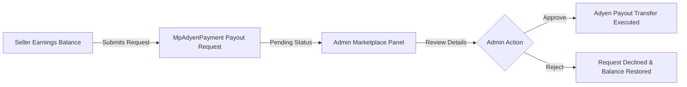

# Payout Workflows

Learn how seller earnings are managed, requested, approved, and transferred under both Manual Classic and Automatic Split modes.

---

## Manual Classic Payout Workflow

In **Manual Classic Payout Mode**, sellers initiate withdrawal requests from their account dashboard.

### Steps:
1. **Seller Submission**: Seller visits **Marketplace > Adyen Payouts**, enters payout amount, and clicks **Submit Payout Request**.

2. **Admin Verification**: Admin opens **Marketplace > Adyen Payout Requests** grid in the backend.

3. **Execution**: Admin clicks **Approve**. The system invokes Adyen Payout API service and logs transaction PSP reference.

---

## Automatic Platforms Split Workflow

In **Automatic Platforms Split Mode**:

1. **Order Authorization**: Order contains products from Vendor A ($100) and Vendor B ($50).
2. **Split Calculation**:
   - Platform Commission (10%): $15
   - Vendor A Sub-account Payout: $90
   - Vendor B Sub-account Payout: $45
3. **Automated Transfer**: Upon payment capture webhook receipt, Adyen transfers split amounts into Vendor A and Vendor B Adyen Account Holders.

---
