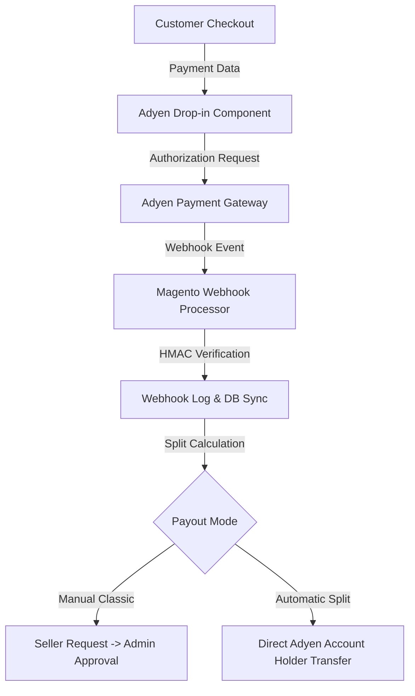

# Introduction

The **Webkul Magento 2 Marketplace Adyen Payment Gateway** module (`Webkul_MpAdyenPayment`) provides seamless integration between the Adyen payment platform and the Webkul Multi-Vendor Marketplace for Magento 2.

This extension enables store owners to accept online credit card and global payment methods via Adyen while managing multi-vendor split payments, automated payouts, and seller account onboarding.

---

## Key Features

- **Adyen Web Drop-in Integration**: Native client-side payment component supporting Credit Cards, 3D Secure 2 authentication, and localized payment methods.
- **Dual Payout Modes**:
  - **Manual Classic Payout**: Sellers submit withdrawal requests from their marketplace panel, and the admin approves and executes payouts manually.
  - **Automatic Platforms Split**: Split payments are automatically computed upon payment capture and routed directly to seller sub-accounts via Adyen for Platforms.
- **Seller Onboarding & KYC**: Integrated seller account holder creation, bank account registration, and KYC verification status synchronization.
- **Robust Webhook Processor**: Secure webhook handling with HMAC signature validation to process authorization, capture, refund, and payout notifications asynchronously.
- **Performance Optimized Architecture**: Built with efficient caching and optimized asset loading to ensure fast page speeds and smooth checkout experiences.
- **Full Magento 2 Standard Compliance**: Adheres to official Magento coding and security standards to ensure high reliability and seamless compatibility with store upgrades.

---

## System Architecture Overview

---

## Next Steps

Explore the documentation to set up and configure your payment gateway:

- Review [Requirements](/requirements) for environment compatibility.
- Follow [Installation Guide](/installation) for module installation steps.
- Configure credentials in [General Configuration](/features/general-configuration).
