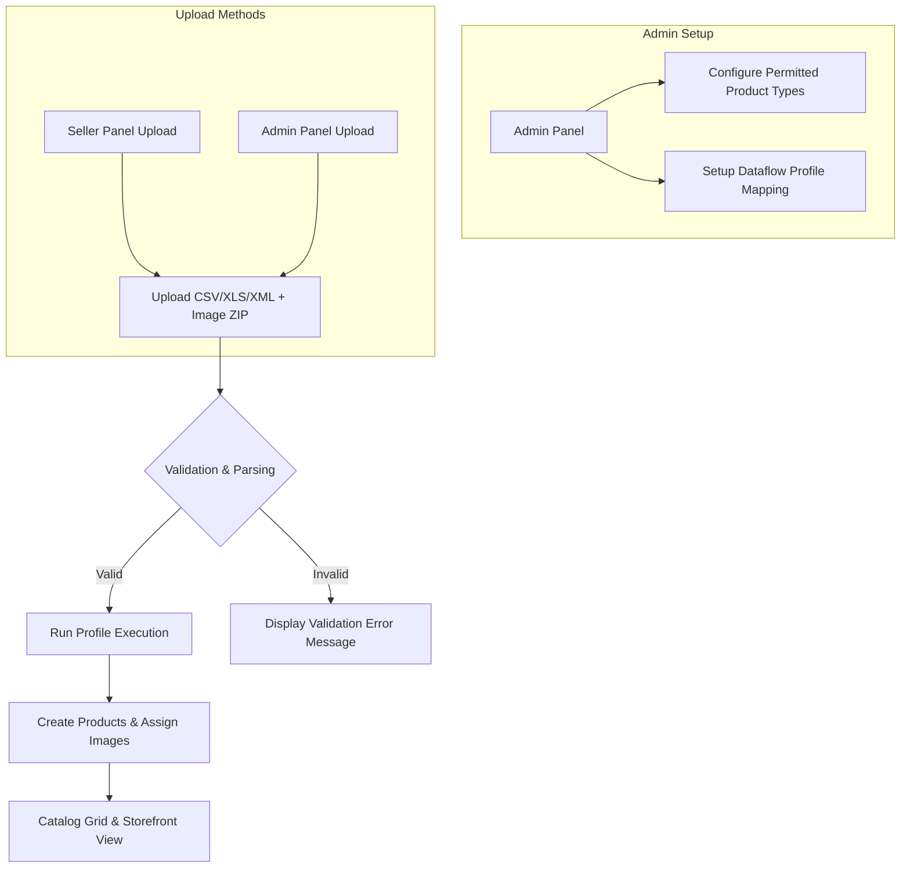

# Introduction

**Magento 2 Multi Vendor Mass Upload** allows marketplace sellers and store administrators to upload large volumes of products into the Magento 2 marketplace using **CSV**, **XLS**, and **XML** data files.

With this add-on, sellers no longer need to add products manually one by one. They can include all essential product attributes—such as name, SKU, price, stock, category, tax class, descriptions, custom options, and product images—directly within a single file and import them in bulk.

::: tip Supported Product Types
The Mass Upload marketplace add-on supports **Simple**, **Configurable**, **Virtual**, and **Downloadable** product types.
:::

---

## Key Features

* **Multiple File Format Support**: Import products seamlessly using `CSV`, `XLS`, or `XML` files.
* **Bulk Image Upload**: Upload product images via an image ZIP archive or by using publicly hosted image URL links directly in the import file.
* **Product Type Flexibility**: Mass upload simple, configurable, downloadable, and virtual product types.
* **Category & Subcategory Mapping**: Assign products to main categories, nested subcategories, or multiple category paths simultaneously using delimited syntax (e.g. `Electronics>>Computers`).
* **Related, Up-Sell & Cross-Sell Links**: Associate related products, up-sell items, and cross-sell items directly through mass upload files.
* **Mass Upload Profile Listing**: View, manage, and delete import profiles that were not executed or need cleanup.
* **Sample Data Files**: Download sample CSV, XLS, and XML templates for every supported product type from the seller panel.
* **Dataflow Column Mapping**: Create custom Dataflow Profiles to map custom file headers to database field attributes.
* **Export Product Data**: Export existing products into CSV format with options to select specific custom attributes.
* **Admin Bulk Upload on Behalf of Sellers**: Administrators can upload products for individual sellers or import products assigned to multiple sellers in a single file via seller ID mapping.
* **Error Detection & Validation**: Built-in validation catches syntax and missing attribute errors before database execution to ensure 100% error-free imports.
* **Multilingual & RTL Support**: Compatible with Magento locale options and language translation files.
* **Modern Stack Compatibility**: Compatible with **GraphQL**, **MSI (Multi-Source Inventory)**, **Hyvä Theme**, and **Adobe Commerce Cloud**.

---

## High-Level Workflow Architecture

---

## Version Info

* **Current Module Version**: `5.0.5`
* **Base Dependency**: Webkul Magento 2 Multi Vendor Marketplace Extension.
